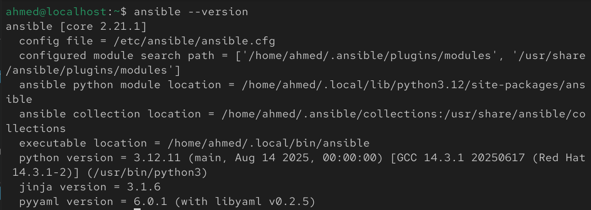
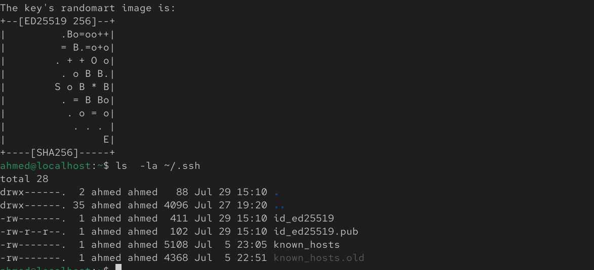
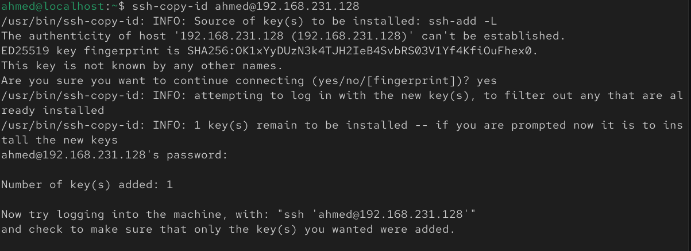
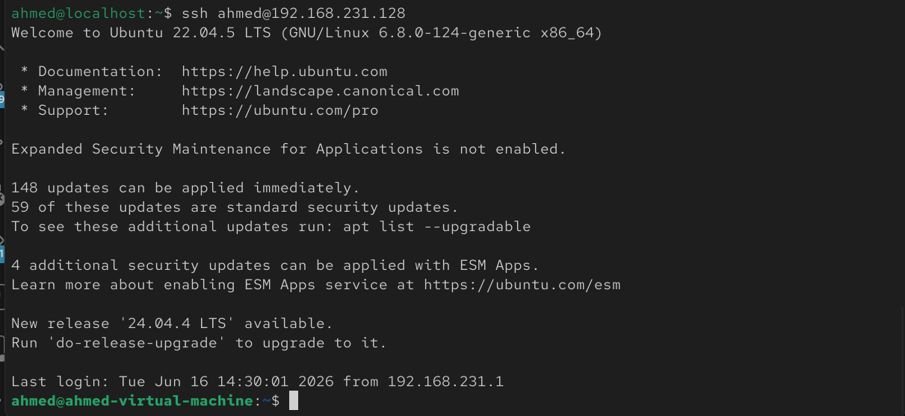
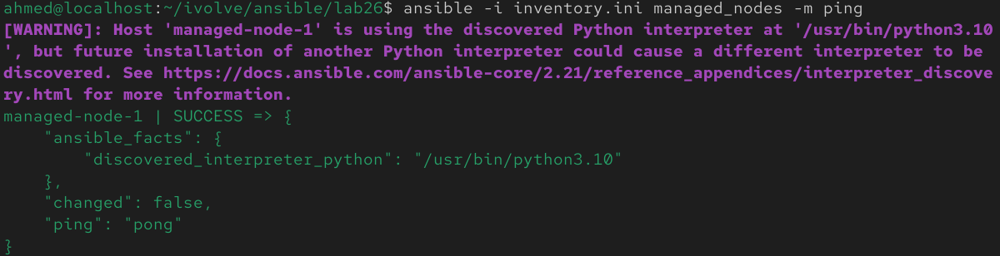
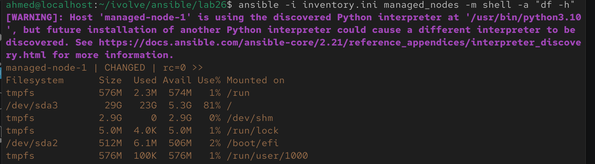

# Lab 26: Initial Ansible Configuration and Ad-Hoc Execution

## Overview

This lab covers the foundational setup required before any real Ansible automation can happen:

1. Installing Ansible on a **control node**
2. Generating an SSH key pair on the control node
3. Copying the public key to a **managed node** for passwordless authentication
4. Defining an inventory file listing the managed node
5. Running a simple **ad-hoc command** (checking disk space) to confirm everything works end-to-end

<br>

---

## Prerequisites

- Two machines (VMs or containers): one acting as the **control node**, one as the **managed node**
- Both machines reachable from each other over the network (same subnet, or routable)
- SSH server running on the managed node
- A regular user account on both machines with sudo privileges
- Python 3 installed on the managed node (Ansible requires it to run modules remotely)

<br>

---

## Step 1: Install Ansible on the Control Node

On the control node:

```bash
sudo apt update
sudo apt install -y software-properties-common
sudo add-apt-repository --yes --update ppa:ansible/ansible
sudo apt install -y ansible
```

Verify the installation:

```bash
ansible --version
```



---

## Step 2: Generate an SSH Key Pair on the Control Node

```bash
ssh-keygen -t ed25519 -C "ansible-control-node"
```

- Accept the default file location (`~/.ssh/id_ed25519`) by pressing Enter
- Optionally set a passphrase, or press Enter twice for no passphrase (simpler for lab automation, but less secure)

Confirm the key pair was created:

```bash
ls -la ~/.ssh/
```

You should see `id_ed25519` (private key) and `id_ed25519.pub` (public key).



---

## Step 3: Copy the Public Key to the Managed Node

```bash
ssh-copy-id <managed-node-user>@<managed-node-ip>
```

Example:

```bash
ssh-copy-id ahmed@192.168.1.50
```

Enter the managed node's password once when prompted — this is the last time it'll be needed, since the public key gets appended to `~/.ssh/authorized_keys` on the managed node.



### Verify passwordless SSH works

```bash
ssh <managed-node-user>@<managed-node-ip>
```

You should log in with no password prompt this time.



---

## Step 4: Create the Inventory File

On the control node, create an inventory file listing the managed node:

```bash
vim inventory.ini
```

Contents:

```ini
[managed_nodes]
managed-node-1 ansible_host=192.168.231.128 ansible_user=ahmed
```

Save and exit.


### Verify Ansible can see the host

```bash
ansible-inventory -i inventory.ini --list
```


### Test connectivity with the built-in ping module

```bash
ansible -i inventory.ini managed_nodes -m ping
```

Expected output: `"ping": "pong"` with a `SUCCESS` status — confirming SSH key auth and Python are both working correctly.



---

## Step 5: Run an Ad-Hoc Command — Check Disk Space

Ad-hoc commands run a single module against the inventory without writing a full playbook — useful for quick one-off checks like this.

```bash
ansible -i inventory.ini managed_nodes -m shell -a "df -h"
```



The output shows the managed node's hostname followed by the disk usage table (`Filesystem`, `Size`, `Used`, `Avail`, `Use%`, `Mounted on`) — exactly as if `df -h` had been run directly on that machine.

<br>

---

## Notes

- The **control node** is where Ansible itself is installed and where all commands/playbooks are run from — managed nodes never need Ansible installed on them, only Python and SSH access.
- SSH key-based auth (via `ssh-copy-id`) removes the need for Ansible to prompt for a password on every run, which is essential once you move beyond ad-hoc commands into playbooks and automation.
- The `[managed_nodes]` group name in the inventory file is arbitrary — it's how you'll target this host (or group of hosts) in future playbooks, e.g. `hosts: managed_nodes`.
- The `ping` module doesn't send an ICMP ping — it verifies Ansible can connect via SSH and execute a Python script on the target, which is a much more meaningful health check for automation purposes.
- Ad-hoc commands (`-m` / `-a` flags) are best for quick, one-time tasks. Anything that needs to be repeatable, version-controlled, or run in a specific order belongs in a **playbook** instead — which is typically the next step after this lab.