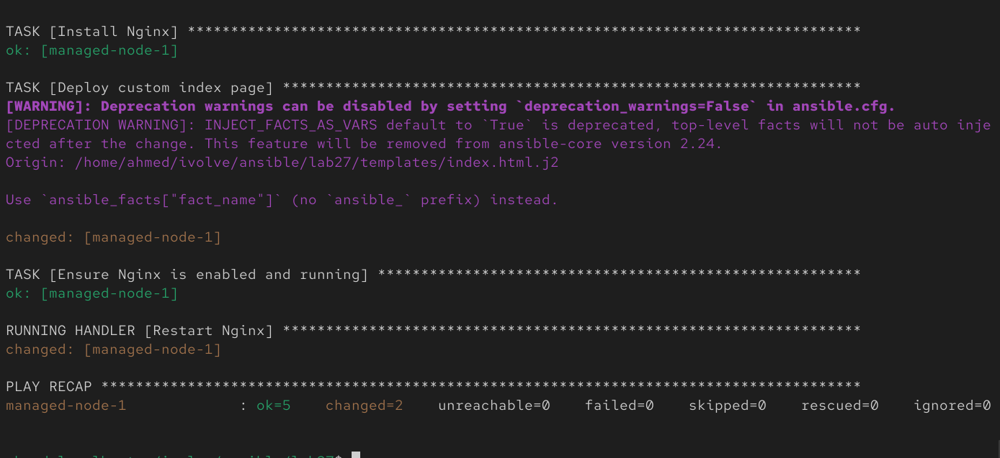
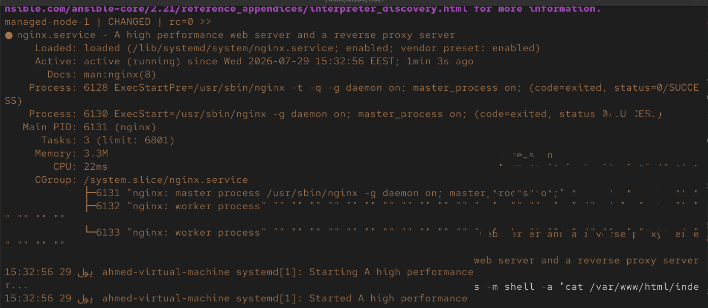
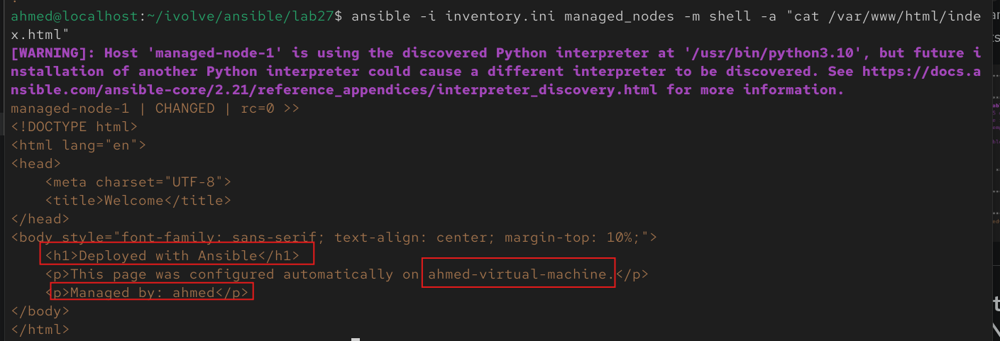
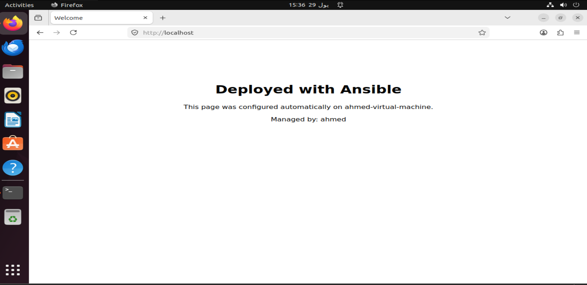

# Lab 27: Automated Web Server Configuration Using Ansible Playbooks

## Overview

This lab moves from ad-hoc commands (Lab 26) into a real **Ansible Playbook** — a repeatable, version-controlled YAML file that automates installing and configuring a web server on the managed node.

The playbook:

1. Installs **Nginx**
2. Deploys a **custom index page**
3. Ensures the Nginx service is enabled and running
4. The configuration is then verified directly on the managed node

<br>

---

## Prerequisites

- Completed Lab 26 (control node with Ansible installed, SSH key-based access to the managed node, working inventory file)
- Managed node reachable via the `managed_nodes` group in `inventory.ini`
- Managed node's package manager matches the playbook (this lab assumes Debian/Ubuntu — `apt`; adjust the module if using a RHEL-based system)

<br>

---

## Step 1: Set Up the Project Structure

On the control node:

```bash
mkdir -p templates
```

Final directory layout:

```text
ansible/lab27/
├── inventory.ini
├── nginx-playbook.yml
└── templates/
    └── index.html.j2
```

<br>

---

## Step 2: Create the Custom Web Page Template

```bash
vim templates/index.html.j2
```

Contents:

```html
<!DOCTYPE html>
<html lang="en">
<head>
    <meta charset="UTF-8">
    <title>Welcome</title>
</head>
<body style="font-family: sans-serif; text-align: center; margin-top: 10%;">
    <h1>Deployed with Ansible</h1>
    <p>This page was configured automatically on {{ ansible_hostname }}.</p>
    <p>Managed by: {{ ansible_user }}</p>
</body>
</html>
```

Using a **Jinja2 template** (`.j2`) instead of a static file lets Ansible inject live facts about the managed node (hostname, user, etc.) into the page at deploy time — proving the customization is dynamic, not just a copied static file.


---

## Step 3: Write the Playbook

```bash
vim nginx-playbook.yml
```

Contents:

```yaml
---
- name: Install and Configure Nginx Web Server
  hosts: managed_nodes
  become: yes

  tasks:
    - name: Install Nginx
      apt:
        name: nginx
        state: present
        update_cache: yes

    - name: Deploy custom index page
      template:
        src: templates/index.html.j2
        dest: /var/www/html/index.html
        owner: www-data
        group: www-data
        mode: '0644'
      notify: Restart Nginx

    - name: Ensure Nginx is enabled and running
      service:
        name: nginx
        state: started
        enabled: yes

  handlers:
    - name: Restart Nginx
      service:
        name: nginx
        state: restarted
```


### What each task does

| Task | Purpose |
|---|---|
| `Install Nginx` | Installs the package via `apt`, refreshing the package cache first |
| `Deploy custom index page` | Renders the Jinja2 template and copies it to Nginx's default web root, setting correct ownership/permissions |
| `Ensure Nginx is enabled and running` | Confirms the service is active now and will start automatically on boot |
| `Restart Nginx` (handler) | Only runs if the index page task actually changed something — avoids unnecessary restarts on repeat runs |

<br>

---

## Step 4: Run the Playbook

```bash
ansible-playbook -i inventory.ini nginx-playbook.yml --ask-become-pass
```

Watch the output — each task reports `ok`, `changed`, or `failed` per host. On a fresh run, expect to see `changed` for all three tasks; on subsequent re-runs with no changes, tasks should report `ok` (this is Ansible's idempotency in action — running the same playbook repeatedly won't cause unintended side effects).



---

## Step 5: Verify the Configuration on the Managed Node

### Option A — verify remotely via Ansible ad-hoc commands

Check the service is active:

```bash
ansible -i inventory.ini managed_nodes -m shell -a "systemctl status nginx --no-pager"
```

Check the deployed page content:

```bash
ansible -i inventory.ini managed_nodes -m shell -a "cat /var/www/html/index.html"
```





### Option B — verify via browser or curl

From the control node (or any machine that can reach the managed node):

```bash
curl http://<managed-node-ip>
```

Or open `http://<managed-node-ip>` in a browser — you should see the custom "Deployed with Ansible" page, with the managed node's actual hostname and user filled in.



This was opened on the managed node itself  via brower.

---

## Notes

- Using `become: yes` at the play level elevates every task to run with `sudo` on the managed node — required here since installing packages and writing to `/var/www/html` needs root privileges.
- The `template` module (Jinja2) is preferred over the `copy` module whenever the file's content should include dynamic values — `copy` only pushes a static file as-is.
- Handlers (like `Restart Nginx`) only fire when a task that `notify`s them actually reports `changed` — this keeps the playbook efficient and avoids restarting services unnecessarily on every run.
- Re-running `ansible-playbook` against an already-configured node is safe and expected — idempotency means only actual drift from the desired state triggers a change.
- If the managed node is RHEL/CentOS/Fedora-based instead of Debian/Ubuntu, swap the `apt` module for `dnf` or `yum`, and the web root may differ (commonly `/usr/share/nginx/html` instead of `/var/www/html`).