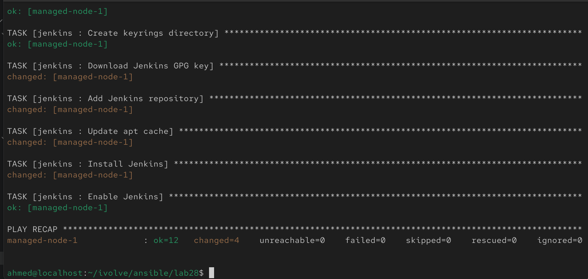
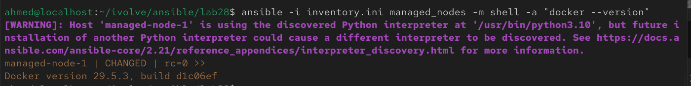
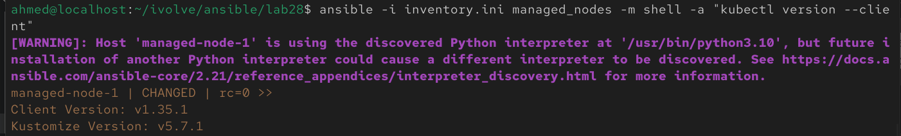
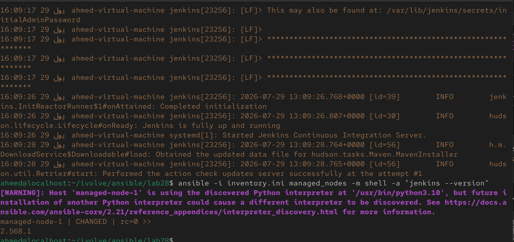
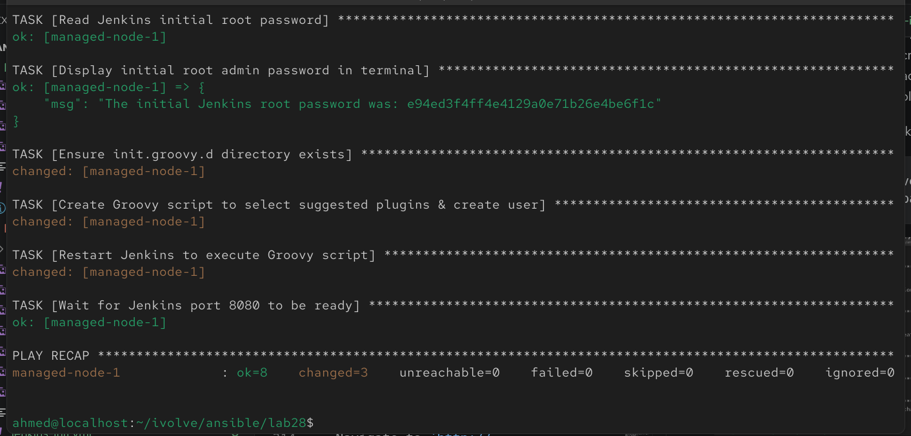
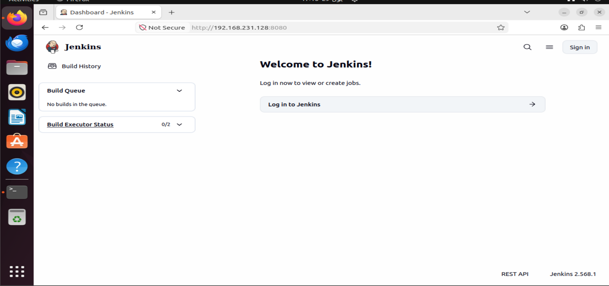
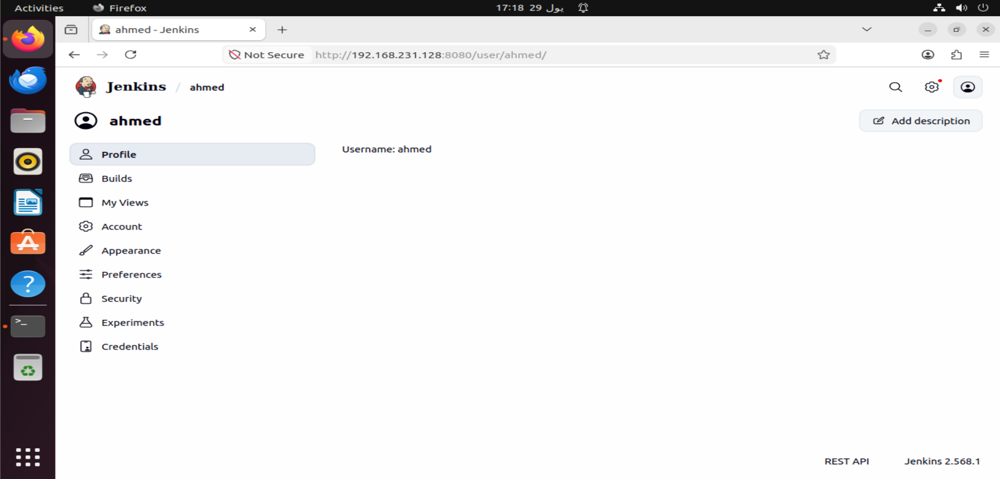
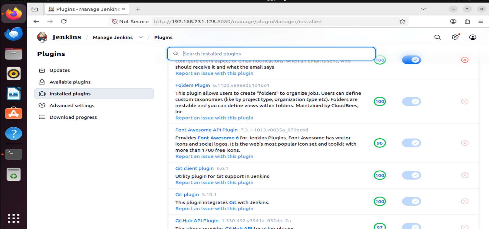

# Lab 28: Structured Configuration Management with Ansible Roles

## Overview

This lab introduces **Ansible Roles**, which provide a structured and reusable way to organize automation code. Instead of placing all tasks inside a single playbook, related tasks are grouped into independent roles that can be reused across multiple projects.

In this lab, three roles are created to automate the installation of:

1. Docker
2. Kubernetes CLI (`kubectl`)
3. Jenkins

A single playbook then executes all roles on the managed node, after which the installations are verified.

<br>

---

## Prerequisites

- Completed Lab 27
- Ansible installed on the control node
- SSH connectivity to the managed node
- Working `inventory.ini`
- Sudo privileges on the managed node

<br>

---

## Step 1: Create the Role Structure

Create the required roles using Ansible Galaxy.

```bash
ansible-galaxy init roles/docker
ansible-galaxy init roles/kubectl
ansible-galaxy init roles/jenkins
```

Project structure:

```text
ansible/lab28/
├── inventory.ini
├── site.yml
└── roles/
    ├── docker/
    │   └── tasks/
    │       └── main.yml
    ├── kubectl/
    │   └── tasks/
    │       └── main.yml
    └── jenkins/
        └── tasks/
            └── main.yml
```

Each role contains its own tasks, handlers, templates, defaults, variables, and files, making the automation modular and easier to maintain.

<br>

---

## Step 2: Configure the Docker Role

Edit:

```bash
vim roles/docker/tasks/main.yml
```

Contents:

```yaml
---
- name: Install Docker
  apt:
    name: 
    - docker-ce
    - docker-ce-cli
    - containerd.io
    state: present
    update_cache: yes

- name: Enable Docker
  service:
    name: docker
    state: started
    enabled: yes
```

This role installs Docker and ensures the service starts automatically after every reboot.

<br>

---

## Step 3: Configure the Kubectl Role

Edit:

```bash
vim roles/kubectl/tasks/main.yml
```

Contents:

```yaml
---
- name: Download kubectl
  get_url:
    url: https://dl.k8s.io/release/v1.35.1/bin/linux/amd64/kubectl
    dest: /usr/local/bin/kubectl
    mode: '0755'

- name: Verify kubectl permissions
  file:
    path: /usr/local/bin/kubectl
    mode: '0755'
```

This role downloads the Kubernetes CLI and makes it executable.

<br>

---

## Step 4: Configure the Jenkins Role

Edit:

```bash
vim roles/jenkins/tasks/main.yml
```

Contents:

```yaml
---
- name: Install Java
  apt:
    name: openjdk-21-jdk
    state: present
    update_cache: yes

- name: Create keyrings directory
  file:
    path: /etc/apt/keyrings
    state: directory
    mode: '0755'

- name: Download Jenkins GPG key
  get_url:
    url: https://pkg.jenkins.io/debian-stable/jenkins.io-2026.key
    dest: /etc/apt/keyrings/jenkins-keyring.asc
    mode: '0644'

- name: Add Jenkins repository
  apt_repository:
    repo: "deb [signed-by=/etc/apt/keyrings/jenkins-keyring.asc] https://pkg.jenkins.io/debian-stable binary/"
    state: present

- name: Update apt cache
  apt:
    update_cache: yes

- name: Install Jenkins
  apt:
    name: jenkins
    state: present

- name: Enable Jenkins
  service:
    name: jenkins
    state: started
    enabled: yes
```

This role installs Java, configures the official Jenkins repository, installs Jenkins, and starts the service.

<br>

---

## Step 5: Create the Playbook

Create:

```bash
vim playbook.yml
```

Contents:

```yaml
---
- name: Configure Development Environment
  hosts: managed_nodes
  become: yes

  roles:
    - docker
    - kubectl
    - jenkins
```

The playbook simply calls each role in sequence. This is the primary advantage of roles—complex configurations become easy to reuse and maintain.

<br>

---

## Step 6: Run the Playbook

Execute:

```bash
ansible-playbook -i inventory.ini playbook.yml --ask-become-pass
```

Expected output:

- Docker installed
- kubectl downloaded
- Jenkins installed
- All services started successfully


<br>

---

## Step 7: Verify Docker Installation

```bash
ansible -i inventory.ini managed_nodes -m shell -a "docker --version"
```

Example output:

```text
Docker version 29.x.x
```



<br>

---

## Step 8: Verify kubectl Installation

```bash
ansible -i inventory.ini managed_nodes -m shell -a "kubectl version --client"
```

Example output:

```text
Client Version: v1.35.1
```



---

## Step 9: Verify Jenkins Installation

Verify the service:

```bash
ansible -i inventory.ini managed_nodes -m shell -a "systemctl status jenkins --no-pager"
```

Or verify the installed version:

```bash
ansible -i inventory.ini managed_nodes -m shell -a "jenkins --version"
```

You can also open:

```text
http://<managed-node-ip>:8080
```

to confirm the Jenkins web interface is available.



## Step 10: Automate Jenkins Initial Setup (Extra Step)

By default, a fresh Jenkins installation is locked behind a wizard that prompts you to enter an initial admin password and select plugins. To achieve 100% automated deployment, we use an initialization playbook (`jenkins-init.yml`) that:

1. **Greps/Reads** the initial root admin password and displays it in the terminal output.
2. Programmatically triggers the **"Install Suggested Plugins"** option in the background.
3. Creates an admin user (`ahmed` / `ahmed`).
4. Bypasses all setup screens and drops us directly onto the main Dashboard.


Create:

```bash
vim jenkins-init.yml
```
### What each task does

| Task | Purpose |
|---|---|
| `Wait for initialAdminPassword` | Ensures Jenkins has finished booting up its first run before reading credentials. |
| `Read & Display Password` | Greps/Cats the initial root password from `/var/lib/jenkins/secrets/initialAdminPassword` and prints it to Ansible output. |
| `Ensure init.groovy.d directory exists` | Creates the `/var/lib/jenkins/init.groovy.d` folder on the managed node so Ansible can place custom startup scripts inside it. Required because fresh Jenkins installations do not create this folder by default. |
| `Create Groovy script` | Places a Groovy script in `init.groovy.d/` that creates user `ahmed` / `ahmed`, grants full admin access, downloads suggested plugins, and completes the setup wizard state. |
| `Restart & Wait` | Restarts Jenkins to execute the script and waits until HTTP port 8080 is reachable and plugins are loaded. |

Execute the initialization playbook:

```bash
ansible-playbook -i inventory.ini jenkins-init.yml --ask-become-pass
```


Verify in Browser:
- Navigate to `http://<managed-node-ip>:8080`.
- Log in with Username: ahmed and Password: ahmed.
- Check Manage Jenkins -> Plugins to verify that suggested plugins (Git, Pipeline, etc.) are installed/installing in the background.

Verification result:

- The initial unlock password screen is bypassed and arrive directly at the Jenkins login screen.


- Log in with Username: ahmed and Password: ahmed to access the main Dashboard!


- The script chooses Install suggested plugins.



---

## Notes

- Roles are the recommended way to organize Ansible projects because they separate related automation into reusable components.
- Each role contains its own tasks, handlers, templates, variables, and files, making maintenance much easier than a large monolithic playbook & Because Ansible is idempotent, running `playbook.yml` multiple times will only make changes if the managed node has drifted from the desired configuration.

- **Jenkins Initial Setup**: While injecting an `init.groovy.d` script is a highly effective way to bootstrap the initial admin user and bypass the setup wizard in a custom lab environment, production environments typically utilize Jenkins Configuration as Code (JCasC) plugins or established Ansible Galaxy roles (like `geerlingguy.jenkins`) to manage the Jenkins state long-term.
- We Will use ansible-vault for password encryption for `jenkins-init.yml` on next lab.