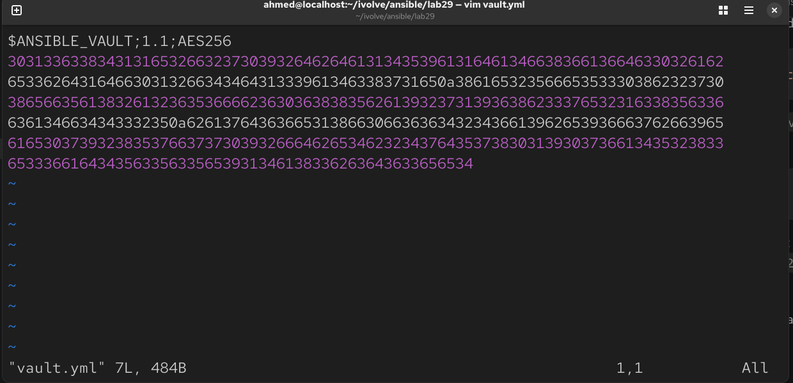
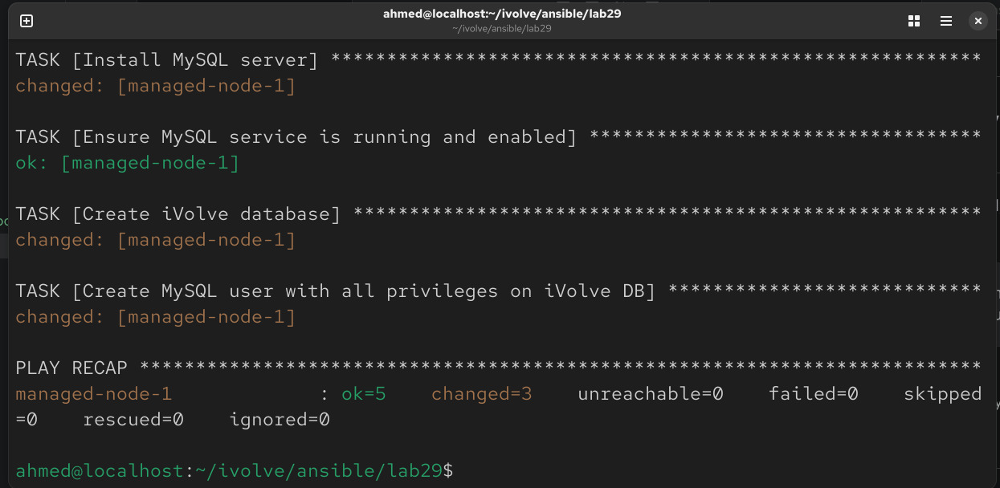
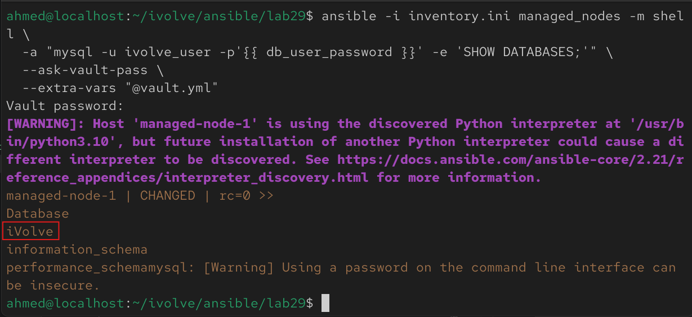

# Lab 29: Securing Sensitive Data with Ansible Vault

## Overview

This lab builds a playbook that installs MySQL, creates a database and a dedicated user, and — critically — uses **Ansible Vault** to encrypt the database password instead of storing it in plaintext anywhere in the repo.

The playbook:

1. Installs MySQL Server
2. Creates the `iVolve` database
3. Creates a MySQL user with full privileges on that database
4. Reads the user's password from an **encrypted Vault file**, never plaintext
5. The setup is then validated by connecting to MySQL as the new user and listing databases

<br>

---

## Prerequisites

- Completed Labs 26–28 (control node with Ansible, working inventory, passwordless sudo on the managed node)
- Managed node running Ubuntu/Debian
- `python3-pymysql` available for Ansible's MySQL modules to use (installed as part of this playbook)

<br>

---

## Step 1: Create the Vault File for Secrets

Rather than hardcoding the database password in the playbook, store it in a separate Vault-encrypted variables file.

```bash
cd ./ansible/lab29
ansible-vault create vault.yml
```

You'll be prompted to set a **Vault password** — this is what encrypts/decrypts the file. Remember it; there's no recovery without it.

Inside the editor that opens, add:

```yaml
db_user_password: "S3cur3P@ssw0rd!"
```

Save and exit. The file on disk (`vault.yml`) is now fully encrypted — confirm:

```bash
cat vault.yml
```

You'll see unreadable ciphertext (`$ANSIBLE_VAULT;1.1;AES256...`), not the plaintext password.


### Editing the vault later (if needed)

```bash
ansible-vault edit vault.yml
```

### Viewing the vault's contents (without editing)

```bash
ansible-vault view vault.yml
```

<br>

---

## Step 2: Write the Playbook

```bash
vim mysql-playbook.yml
```

```yaml
---
- name: Install and Configure MySQL with Vault-Protected Credentials
  hosts: managed_nodes
  become: yes

  vars_files:
    - vault.yml

  vars:
    db_name: iVolve
    db_user: ivolve_user

  tasks:
    - name: Install MySQL server
      apt:
        name:
          - mysql-server
          - python3-pymysql
        state: present
        update_cache: yes

    - name: Ensure MySQL service is running and enabled
      service:
        name: mysql
        state: started
        enabled: yes

    - name: Create iVolve database
      mysql_db:
        name: "{{ db_name }}"
        state: present
        login_unix_socket: /var/run/mysqld/mysqld.sock

    - name: Create MySQL user with all privileges on iVolve DB
      mysql_user:
        name: "{{ db_user }}"
        password: "{{ db_user_password }}"
        priv: "{{ db_name }}.*:ALL"
        host: "%"
        state: present
        login_unix_socket: /var/run/mysqld/mysqld.sock
```

Note: Use the local MySQL Unix socket for authentication, as Ubuntu's default MySQL


---

## Step 3: Run the Playbook with the Vault Password

Since `vault.yml` is encrypted, Ansible needs the Vault password to decrypt it at runtime:

```bash
ansible-playbook -i inventory.ini mysql-playbook.yml --ask-vault-pass --ask-become-pass
```



---

## Step 4: Validate the Database Setup on the Managed Node

### Connect as the new user and list databases

```bash
ansible -i inventory.ini managed_nodes -m shell \
  -a "mysql -u ivolve_user -p'{{ db_user_password }}' -e 'SHOW DATABASES;'" \
  --ask-vault-pass \
  --extra-vars "@vault.yml"
```

A cleaner approach — add a dedicated validation task to the playbook itself, so the password never has to be typed on the command line at all:

```yaml
    - name: Validate DB connection and list databases
      command: >
        mysql -u {{ db_user }} -p{{ db_user_password }}
        -e "SHOW DATABASES;"
      register: db_list
      changed_when: false

    - name: Show database list
      debug:
        var: db_list.stdout_lines
```

Add this to the end of `mysql-playbook.yml`, then re-run previous command.

The `debug` task output should list `iVolve` alongside MySQL's default databases (`information_schema`, `performance_schema`), confirming the user has been created correctly and can authenticate and query.


---

## Notes

- **Ansible Vault** encrypts entire files (or individual string values, via `ansible-vault encrypt_string`) using AES256 — the encrypted content is safe to commit to Git, since it's unreadable without the vault password.
- `vars_files` is what pulls the encrypted variables into scope for the play — Ansible transparently decrypts them in memory at runtime using whichever vault password/file was supplied on the command line.

- For real projects with multiple environments (dev/staging/prod), it's common to use **multiple vault files with different vault IDs** (`--vault-id dev@prompt`, `--vault-id prod@prompt`) so different teams/pipelines can hold different secrets without needing access to all of them.

