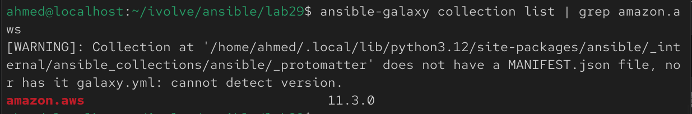
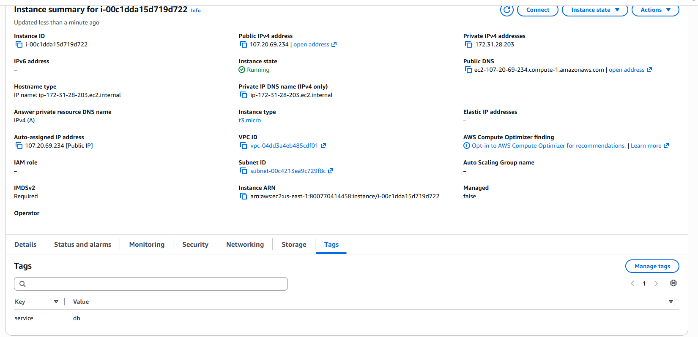
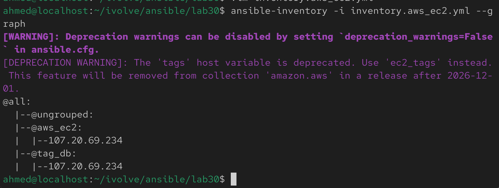
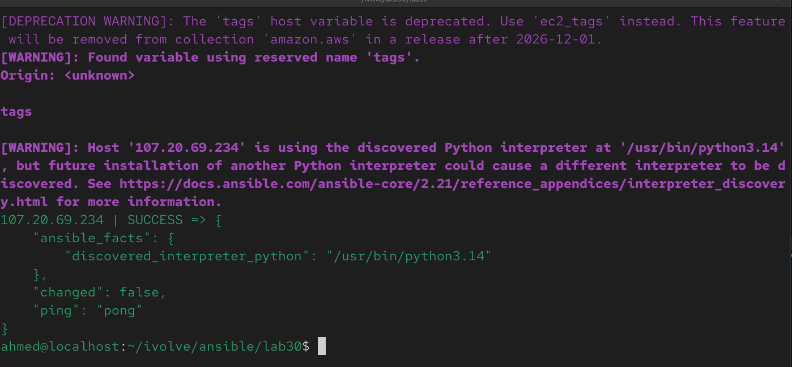
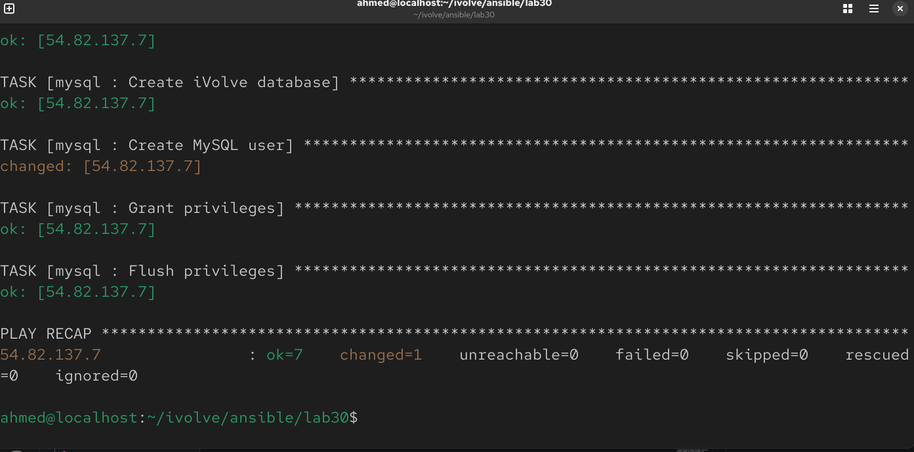
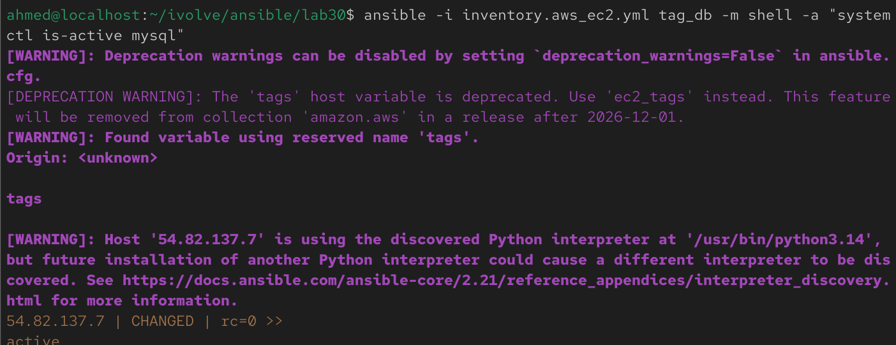
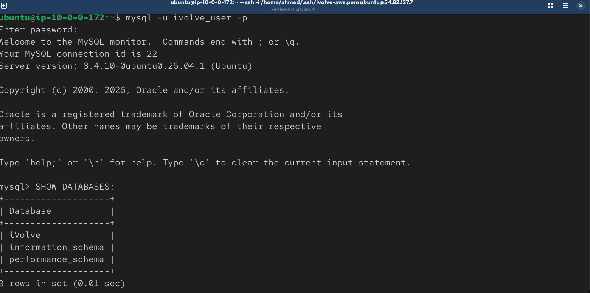

# Lab 30: Automated Host Discovery with Ansible Dynamic Inventory

## Overview

Every prior lab used a **static inventory** (`inventory.ini`) with manually listed hosts. This lab replaces that with a **dynamic inventory** — Ansible queries AWS directly at runtime and automatically discovers which EC2 instances to manage, based on tags, instead of you hardcoding IPs.

The flow:

1. Launch an EC2 instance tagged `service:db`
2. Configure the `amazon.aws` dynamic inventory plugin to discover instances by that tag
3. List the discovered hosts using `ansible-inventory`
4. Run the MySQL role (from Lab 29's playbook) against the dynamically discovered host — no static IP ever entered manually

<br>

---

## Prerequisites

- An AWS account with permissions to launch EC2 instances and read EC2 metadata (`ec2:DescribeInstances`)
- AWS CLI installed and configured on the control node (`aws configure`)
- Ansible control node with the `amazon.aws` collection installed
- An SSH key pair registered in AWS for the EC2 instance
- The security group for the instance allows inbound SSH (port 22) from the control node's IP

<br>

---

## Step 1: Install Required Ansible Collections and Python Dependencies

```bash
ansible-galaxy collection install amazon.aws
pip install boto3 botocore --break-system-packages
```

Verify:

```bash
ansible-galaxy collection list | grep amazon.aws
```



---

## Step 2: Configure AWS Credentials

```bash
aws configure
```

Provide:
- **AWS Access Key ID**
- **AWS Secret Access Key**
- **Default region** (e.g. `us-east-1`)
- **Default output format** (e.g. `json`)

Verify access works:

```bash
aws sts get-caller-identity
```


---

## Step 3: Launch an EC2 Instance Tagged `service:db`

### Option A — via AWS Console

- **Launch Instance**
- Choose an AMI (e.g. Ubuntu 22.04 LTS)
- Instance type: `t3.micro` (free tier eligible)
- Select or create a key pair, download the `.pem` file
- Configure security group: allow inbound SSH (port 22) from your IP
- Under **Tags**, add:
  - Key: `service`
  - Value: `db`
- Launch



### Option B — via AWS CLI

```bash
aws ec2 run-instances \
  --image-id ami-0c101f26f147fa7fd \
  --instance-type t2.micro \
  --key-name <your-key-pair-name> \
  --security-group-ids <your-sg-id> \
  --subnet-id <your-subnet-id> \
  --tag-specifications 'ResourceType=instance,Tags=[{Key=service,Value=db}]'
```
- Make sure to allow SSH and Network connection on the EC2.

### Move the SSH key into place

```bash
mv ~/Downloads/<your-key-pair-name>.pem ~/.ssh/
chmod 400 ~/.ssh/<your-key-pair-name>.pem
```

<br>

---

## Step 4: Configure the Dynamic Inventory

Create a dynamic inventory config file — the `.aws_ec2.yml` suffix (or `.aws_ec2.yaml`) is what tells Ansible to use the `amazon.aws.aws_ec2` plugin automatically.

```bash
cd ~/ansible-lab
vim inventory.aws_ec2.yml
```

```yaml
plugin: amazon.aws.aws_ec2
regions:
  - us-east-1
filters:
  tag:service: db
  instance-state-name: running
keyed_groups:
  - key: tags.service
    prefix: tag
hostnames:
  - ip-address
compose:
  ansible_host: public_ip_address
  ansible_user: "'ubuntu'"
  ansible_ssh_private_key_file: "'/home/ahmed/.ssh/ivolve-ec2.pem'"
```

### What each section does

| Field | Purpose |
|---|---|
| `plugin` | Tells Ansible to use the AWS EC2 dynamic inventory plugin |
| `regions` | Restricts the API query to specific AWS region(s) |
| `filters` | Only includes instances matching the `service:db` tag and currently in `running` state |
| `keyed_groups` | Auto-creates an Ansible group (e.g. `tag_db`) based on the tag value, so you can target it by name |
| `compose` | Dynamically sets connection variables — here, using the instance's public IP and the default `ubuntu` SSH user |


---

## Step 5: List the Target Hosts

```bash
ansible-inventory -i inventory.aws_ec2.yml --graph
```

Expected output shows the auto-discovered host nested under the `tag_db` group (created by `keyed_groups`):

```text
@all:
  |--@ungrouped:
  |--@tag_db:
  |  |--<discovered-ip-or-hostname>
  |--@aws_ec2:
  |  |--<discovered-ip-or-hostname>
```


For full connection details per host:

```bash
ansible-inventory -i inventory.aws_ec2.yml --list
```

<br>

### Test connectivity

```bash
ansible -i inventory.aws_ec2.yml tag_db -m ping
```

Expected: `"ping": "pong"` — confirming Ansible can reach and authenticate to the dynamically discovered instance via SSH.



---

## Step 6: Run the MySQL Role Against the Dynamic Inventory

Reusing the role structure and vault setup from Labs 28–29, point the playbook at the `tag_db` group instead of the old static `managed_nodes` group.

```bash
vim mysql-playbook.yml
```

```yaml
---
- name: Install and Configure MySQL on Dynamically Discovered DB Hosts
  hosts: tag_db
  become: yes

  vars_files:
    - vault.yml

  vars:
    db_name: iVolve
    db_user: ivolve_user

  roles:
    - mysql
```

> If MySQL setup was previously written directly as tasks (Lab 29) rather than as a role, move those same tasks into `roles/mysql/tasks/main.yml` to match the role-based structure from Lab 28.

Run it, pointing explicitly at the dynamic inventory file:

```bash
ansible-playbook -i inventory.aws_ec2.yml mysql-playbook.yml --ask-vault-pass --ask-become-pass
```


---

## Step 7: Verify

```bash
ansible -i inventory.aws_ec2.yml tag_db -m shell -a "systemctl is-active mysql"
ansible -i inventory.aws_ec2.yml tag_db -m shell -a "mysql -u ivolve_user -p'<password>' -e 'SHOW DATABASES;'"
```




---

## Notes

- Dynamic inventory removes the need to manually track and update IPs as EC2 instances are created, terminated, or replaced — the `tag:service=db` filter means **any** instance with that tag is automatically included the next time Ansible runs, with zero inventory file edits.
- The `.aws_ec2.yml` filename suffix is a strict Ansible convention — without it, the plugin won't be auto-detected even if the file content is otherwise correct.
- `keyed_groups` is what makes tag-based targeting possible in playbooks (`hosts: tag_db`) — without it, you'd only have the flat `aws_ec2` group containing every discovered instance regardless of tag.

- Credentials for AWS API access (`aws configure`) are separate from SSH credentials for the instance itself (`ansible_ssh_private_key_file`) — dynamic inventory needs both: API access to discover instances, and SSH access to actually manage them.
- In a real environment, hardcoding the AWS Access Key/Secret via `aws configure` on a shared control node isn't ideal — an IAM role attached to the control node (if it's itself an EC2 instance) or a secrets manager integration would be the production-grade approach instead.