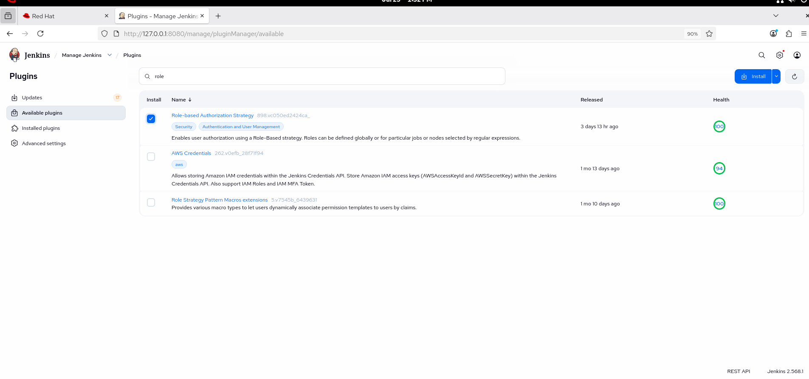
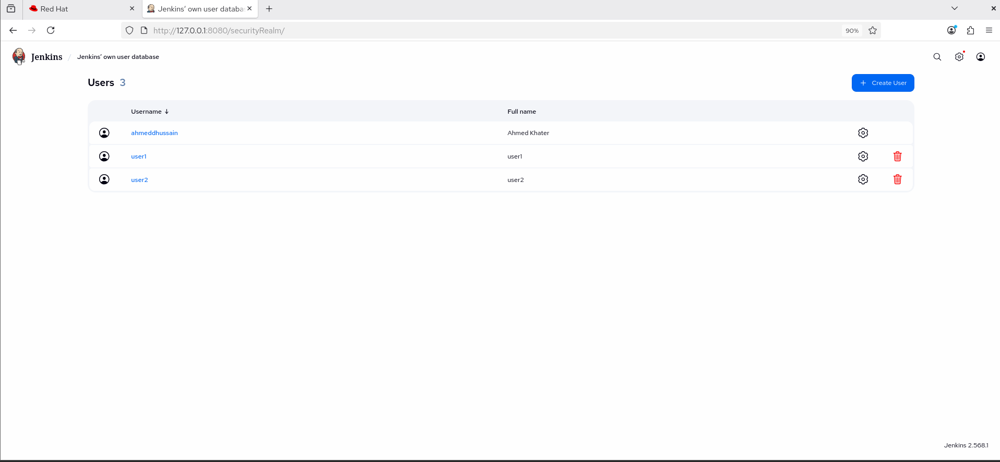
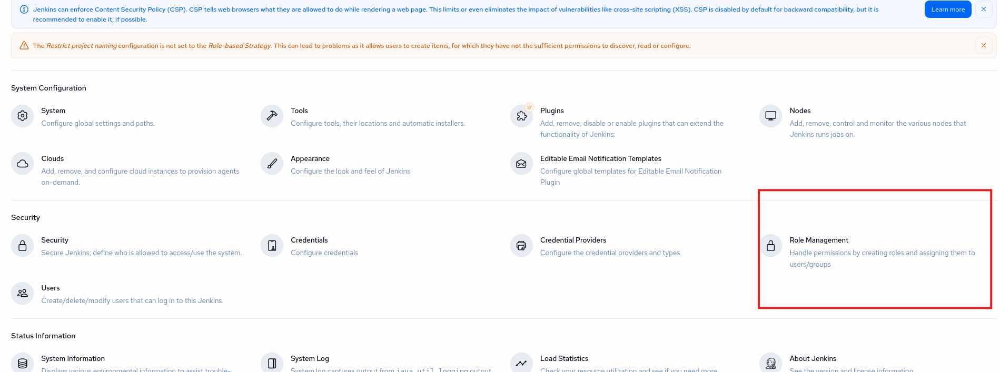
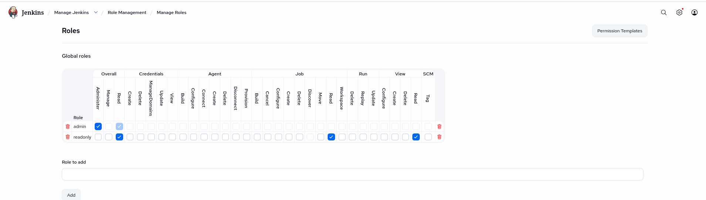
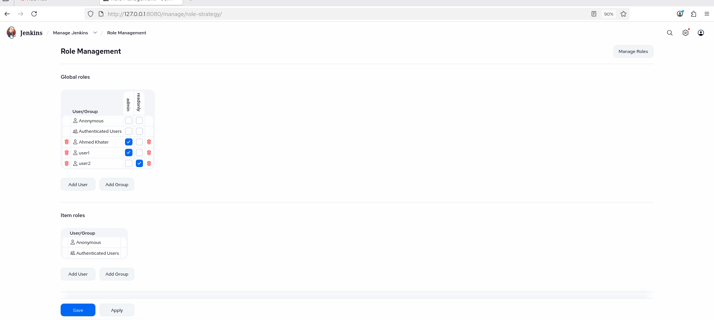
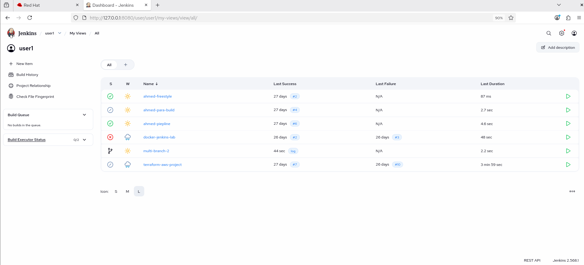
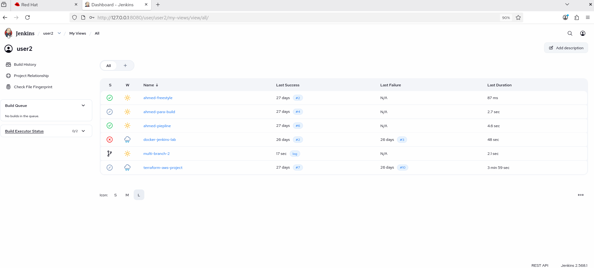

# Lab 21: Role-Based Authorization in Jenkins

## Overview
This lab demonstrates how to secure Jenkins using the Role-based Authorization Strategy plugin. Two users are created with different roles: an administrator with full access and a read-only user with limited permissions.

## Prerequisites
Before starting, make sure you have:
- Jenkins installed and running
- Administrator access to Jenkins
- Internet access to download Jenkins plugins

## Step 1: Install the Role-based Authorization Strategy Plugin
Navigate to:

```text
Manage Jenkins
    → Plugins
    → Available Plugins
```

Search for:

```text
Role-based Authorization Strategy
```

Install the plugin and restart Jenkins if prompted.



## Step 2: Create Jenkins Users
Navigate to:

```text
Manage Jenkins
    → Security
    → Users
```

Create the following users:

- `user1`
- `user2`



## Step 3: Enable Role-Based Authorization
Navigate to:

```text
Manage Jenkins
    → Security
```

Configure:

- **Security Realm:** Jenkins' own user database
- **Authorization:** Role-Based Strategy

Click **Save**.



## Step 4: Create Roles
Navigate to:

```text
Manage Jenkins
    → Manage and Assign Roles
        → Manage Roles
```

Create the following roles:

### admin
Grant all available permissions.

### readonly
Grant only the following permissions:

- Overall → Read
- Job → Read
- View → Read

Click **Save**.



## Step 5: Assign Roles to Users
Navigate to:

```text
Manage Jenkins
    → Manage and Assign Roles
        → Assign Roles
```

Assign:

| User | Role |
|------|------|
| user1 | admin |
| user2 | readonly |

Click **Save**.



## Step 6: Validate User Permissions
Log in as **user1** and verify that the user can:

- Create jobs
- Configure jobs
- Build jobs
- Delete jobs
- Access **Manage Jenkins**

Log out and log in as **user2** and verify that the user can:

- View existing jobs
- View build history

Verify that the user **cannot**:

- Create jobs
- Configure jobs
- Build jobs
- Delete jobs
- Access **Manage Jenkins**





`Note the diffrence for user1 --> build is allowed , but for user2 --> builds are view only`

## Notes
- The Role-based Authorization Strategy plugin provides more flexible permission management than the built-in authorization methods.
- Users can be assigned one or more roles depending on their responsibilities.
- Always ensure at least one administrator role exists to avoid locking yourself out of Jenkins.