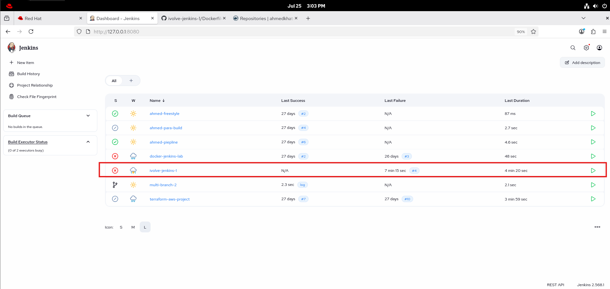
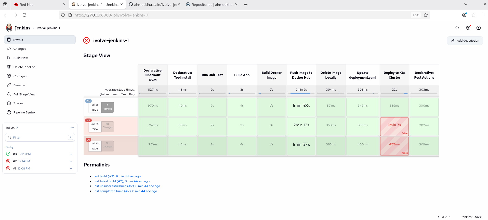
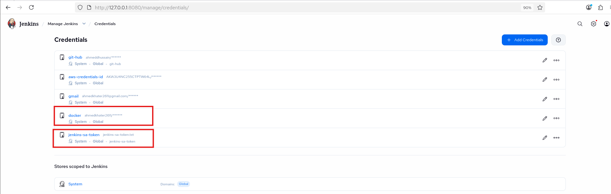
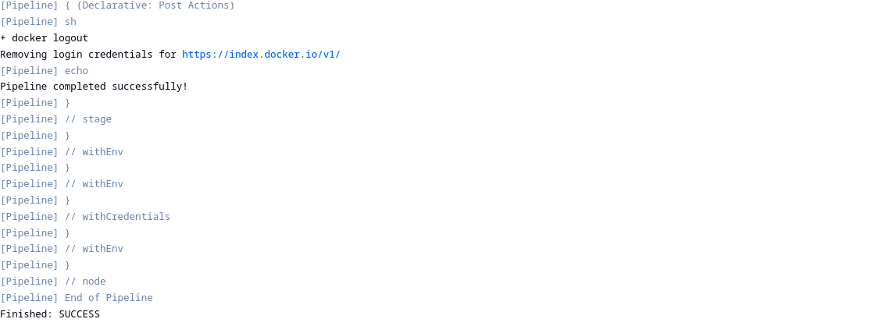
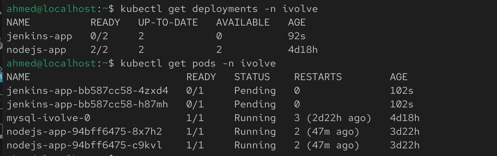

# Lab 22: Jenkins Pipeline for Application Deployment

## Overview

This lab demonstrates how to automate a complete CI/CD workflow using a **Jenkins Declarative Pipeline**.

The pipeline:

1. Clones the application source code from GitHub (via "Pipeline script from SCM")
2. Runs unit tests
3. Builds the application
4. Builds a Docker image from the app's Dockerfile
5. Pushes the image to Docker Hub
6. Removes the local Docker image to free up disk space
7. Updates the Kubernetes `deployment.yaml` with the new image tag
8. Deploys the application to the Kubernetes cluster
9. Runs post actions (`always`, `success`, `failure`) regardless of outcome

---

## Prerequisites

Before starting, make sure you have:

- Jenkins installed and running
- Maven and JDK available on the Jenkins agent (system-installed or via Jenkins Tools)
- Docker installed on the Jenkins host, with the `jenkins` user granted access to `/var/run/docker.sock`
- A Docker Hub account
- A Kubernetes cluster with `kubectl` access
- A scoped ServiceAccount + Role/RoleBinding for Jenkins to deploy with
- Git installed
- Docker Hub credentials configured in Jenkins
- Kubernetes ServiceAccount token configured in Jenkins as a Secret file credential

---

## Step 1: Clone the Repository

Clone the application source code and Dockerfile to inspect the project structure.

```bash
git clone https://github.com/ahmeddhussain/ivolve-jenkins-1.git
cd ivolve-jenkins-1
ls -la
```

This is a Spring Boot (Maven) application — `pom.xml` sits in the repo root, and the `Dockerfile` builds a runnable jar image.


---

## Step 2: Create a Pipeline Job

From the Jenkins Dashboard:

1. Click **New Item**
2. Enter a pipeline name (e.g. `ivolve-jenkins-1`)
3. Select **Pipeline**
4. Click **OK**

<br>



<br>

---

## Step 3: Configure the Pipeline Source

Under **Pipeline → Definition**, select **Pipeline script from SCM**:

- **SCM**: Git
- **Repository URL**: `https://github.com/ahmeddhussain/ivolve-jenkins-1.git`
- **Branch**: `*/main`
- **Script Path**: `Jenkinsfile`


---

## Step 4: The Jenkinsfile

The full pipeline definition, stored in the repo as `Jenkinsfile`:

```groovy
pipeline {
    agent any
    tools {
        maven 'Maven3'
    }
    environment {
        DOCKERHUB_CREDS = credentials('docker')
        IMAGE_NAME      = "ahmedkhater2611/jenkins-app"
        IMAGE_TAG       = "${BUILD_NUMBER}"
        JAR_NAME        = "demo-0.0.1-SNAPSHOT.jar"
    }

    stages {

        stage('Run Unit Test') {
            steps {
                sh 'mvn test'
            }
        }

        stage('Build App') {
            steps {
                sh 'mvn clean package -DskipTests'
            }
            post {
                success {
                    sh "ls -la target/${JAR_NAME}"
                }
            }
        }

        stage('Build Docker Image') {
            steps {
                sh "docker build -t ${IMAGE_NAME}:${IMAGE_TAG} ."
            }
        }

        stage('Push Image to Docker Hub') {
            steps {
                sh """
                    echo \$DOCKERHUB_CREDS_PSW | docker login -u \$DOCKERHUB_CREDS_USR --password-stdin
                    docker push ${IMAGE_NAME}:${IMAGE_TAG}
                """
            }
        }

        stage('Delete Image Locally') {
            steps {
                sh "docker rmi ${IMAGE_NAME}:${IMAGE_TAG}"
            }
        }

        stage('Update deployment.yaml') {
            steps {
                sh "sed -i 's|image:.*|image: ${IMAGE_NAME}:${IMAGE_TAG}|' deployment.yaml"
            }
        }

        stage('Deploy to K8s Cluster') {
            steps {
                withCredentials([file(credentialsId: 'jenkins-sa-token', variable: 'SA_TOKEN_FILE')]) {
                    sh '''
                        kubectl apply -f deployment.yaml \
                          --server=https://<K8S_API_SERVER>:6443 \
                          --insecure-skip-tls-verify=true \
                          --token=$(cat $SA_TOKEN_FILE) \
                          -n ivolve
                    '''
                }
            }
        }
    }

    post {
        always {
            sh 'docker logout || true'
        }
        success {
            echo 'Pipeline completed successfully — deployment finished.'
        }
        failure {
            echo 'Pipeline failed — check the stage logs above.'
        }
    }
}
```

<br>



<br>

---

## Step 5: Configure Docker Hub Credentials

Navigate to:

```text
Manage Jenkins → Credentials → System → Global credentials → Add Credentials
```

- **Kind**: Username with password
- **Username / Password**: your Docker Hub username and access token
- **ID**: `dockerhub-creds`

This credential is referenced in the `environment {}` block and used for `docker login` before the push stage.


---

## Step 6: Configure Kubernetes ServiceAccount Credentials

A scoped ServiceAccount (`jenkins-sa`) with a Role limited to `deployments` and `services` in the `ivolve` namespace was created for Jenkins, rather than using a full admin kubeconfig.

Generate a token for the ServiceAccount:

```bash
kubectl create token jenkins-sa -n ivolve --duration=8760h
```

Save the output token to a file and upload it in Jenkins:

```text
Manage Jenkins → Credentials → Add Credentials
```

- **Kind**: Secret file
- **File**: the token file
- **ID**: `jenkins-sa-token`

<br>



<br>

---

## Step 7: Post Actions

The pipeline defines all three post conditions:

| Condition | Purpose |
|---|---|
| `always` | Logs out of Docker Hub regardless of outcome, to avoid leaving credentials cached on the agent |
| `success` | Confirms the deployment completed |
| `failure` | Flags that something in the pipeline broke, prompting a log review |

<br>



<br>

---

## Step 8: Verify the Deployment

Once the pipeline finishes successfully, verify the app is running on the cluster:

```bash
kubectl get deployments -n ivolve
kubectl get pods -n ivolve

```

It is gonna be pending due to taints and affinity on both nodes on my minikube server.





---

## Notes

- Jenkins Pipelines automate the full CI/CD workflow using a version-controlled `Jenkinsfile` stored alongside the application code.
- Docker images are tagged with the Jenkins `BUILD_NUMBER` to uniquely identify each build.
- Deleting the local Docker image after pushing frees disk space on the Jenkins agent.
- Updating `deployment.yaml` in-pipeline ensures Kubernetes always deploys the exact image just built and pushed.
- A scoped Kubernetes ServiceAccount (rather than a full admin kubeconfig) limits what the pipeline can do on the cluster — least privilege by design.
- Post actions (`always`, `success`, `failure`) provide consistent cleanup and status reporting regardless of how the pipeline ends.