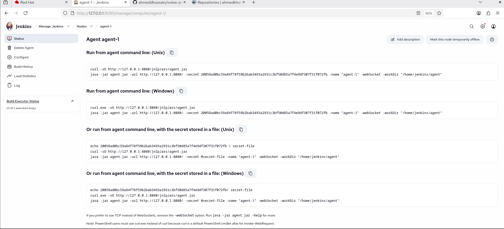
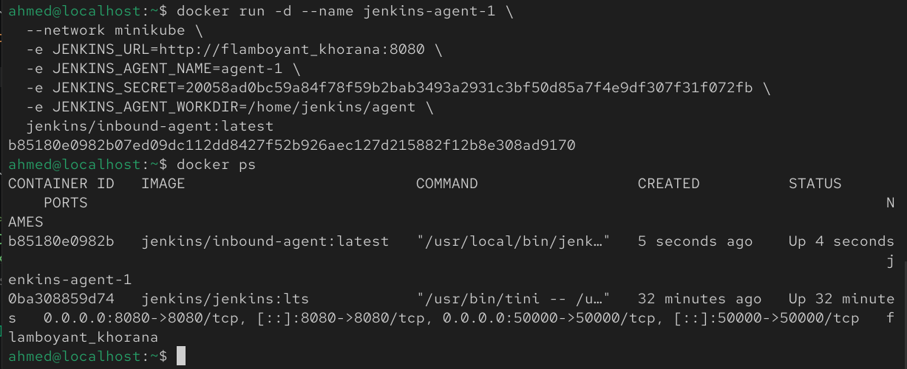
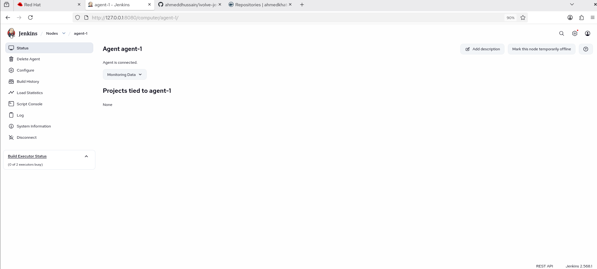
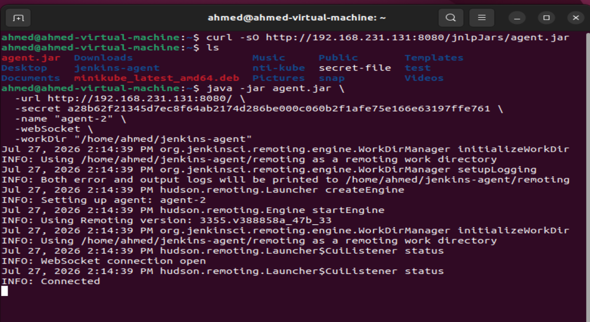
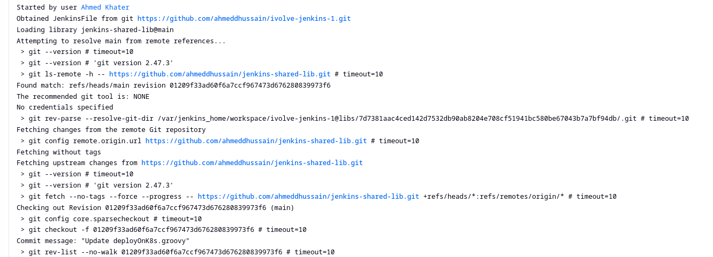
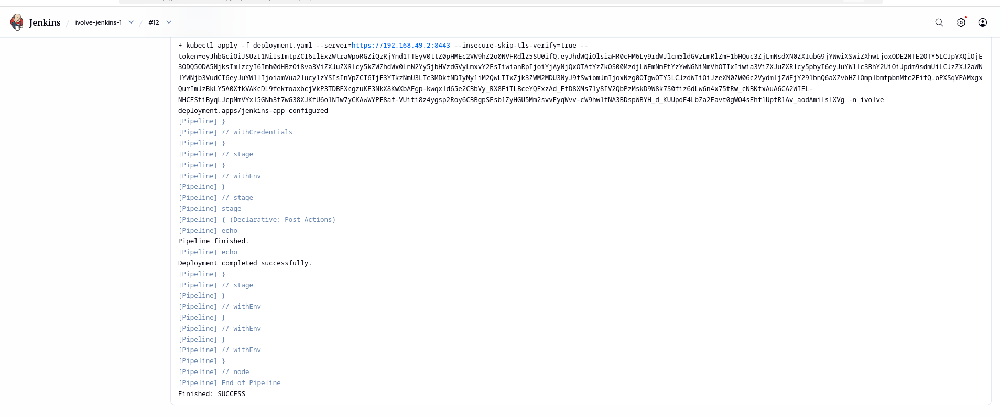
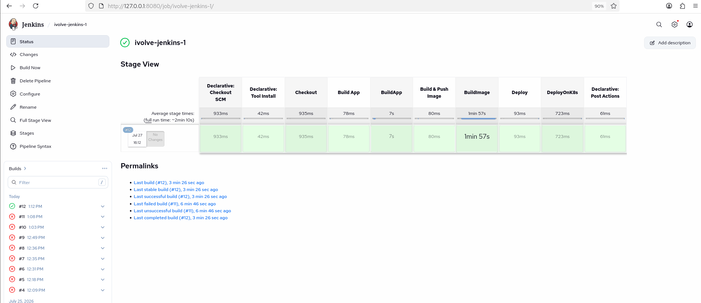

# Lab 23: CI/CD Pipeline Implementation with Jenkins Agents and Shared Libraries

## Overview

This lab extends the CI/CD pipeline built in Lab 22 by introducing two production-grade Jenkins practices:

1. **Jenkins Agents (Slaves)** — offloading pipeline execution from the Jenkins controller onto a dedicated build agent, rather than running everything on `agent any` (the controller itself).
2. **Shared Libraries** — extracting reusable pipeline logic (`BuildApp`, `BuildImage`, `DeployOnK8s`) into a separate Git repository, so multiple Jenkinsfiles across multiple projects can call the same tested, version-controlled functions instead of duplicating pipeline code.

<br>

---

## Prerequisites

- A working Jenkins controller (from Labs 21–22)
- Docker installed wherever the agent will run
- A second machine, VM, or container available to act as the Jenkins agent
- Git installed
- Docker Hub credentials configured in Jenkins (`docker`)
- Kubernetes ServiceAccount token configured in Jenkins (`jenkins-sa-token`)
- A separate Git repository to host the Shared Library (e.g. `jenkins-shared-lib`)

<br>

---

## Part 1: Configure a Jenkins Agent

### Step 1: Create the agent

The simplest approach for a lab is to run the agent as a Docker container on the same host as the Jenkins controller, connected via a permanent **inbound (JNLP) agent**.

On the Jenkins Dashboard:

```text
Manage Jenkins → Nodes → New Node
```

- **Node name**: `agent-1`
- **Type**: Permanent Agent
- Click **Create**


### Step 2: Configure the agent node

- **Number of executors**: `2`
- **Remote root directory**: `/home/jenkins/agent`
- **Labels**: `agent-1` (this label is what the Jenkinsfile will target)
- **Usage**: "only build jobs with label expressions matching this node"
- **Launch method**: "Launch agent by connecting it to the controller" (inbound/JNLP)
- Save

Jenkins will generate a **secret** and a connection command for this node — copy it, you'll need it in the next step.



### Step 3: Start the agent container

Run the generated agent connection command on the machine that will act as the agent. For a Docker-based agent:

```bash
docker run -d --name jenkins-agent-1 \
  --network minikube \
  -e JENKINS_URL=jenkins-controller:8080 \
  -e JENKINS_AGENT_NAME=agent-1 \
  -e JENKINS_SECRET=<secret-from-jenkins-ui> \
  -e JENKINS_AGENT_WORKDIR=/home/jenkins/agent \
  -v /var/run/docker.sock:/var/run/docker.sock \
  jenkins/inbound-agent:latest
```

> Attaching the agent to the same `minikube` Docker network ensures it can reach the Kubernetes API server directly and mounting `docker.sock` to run builds.

Make sure this agent image (or a custom one built from it) also has `docker`, `mvn`, and `kubectl` installed — same requirements as the controller had in Lab 22.



### Step 4: Verify connection

Back in Jenkins:

```text
Manage Jenkins → Nodes
```

`agent-1` should show as **online** with a green icon.



## Another Way: Using another VM instead of a Docker container:

Create `agent-2` with same configurations as the above and copy the commands of the output after configuration of the node into the agent-VM (same conditions apply):




- Replace local IP within the printed commands with the jenkins-controller machine IP on the same network.
---

## Part 2: Build the Shared Library

### Step 1: Create the library repository structure

Shared Libraries follow a specific folder convention. Create a new Git repo (e.g. `jenkins-shared-lib`) with this structure:

```text
jenkins-shared-lib/
└── vars/
    ├── buildApp.groovy
    ├── buildImage.groovy
    └── deployOnK8s.groovy
```

Each file in `vars/` becomes a global, callable function usable from any Jenkinsfile that imports the library — the filename becomes the function name (e.g. `buildApp.groovy` → `buildApp()`).

<br>

### Step 2: `vars/buildApp.groovy`

```groovy
def call() {
    stage('BuildApp') {
        sh 'mvn test'
        sh 'mvn clean package -DskipTests'
        sh 'ls -la target/*.jar'
    }
}
```

### Step 3: `vars/buildImage.groovy`

```groovy
def call(Map config) {
    def imageName = config.imageName
    def imageTag  = config.imageTag
    def credsId   = config.credsId ?: 'dockerhub-creds'   

    stage('BuildImage') {
        withCredentials([usernamePassword(
            credentialsId: credsId,
            usernameVariable: 'DOCKER_USER',
            passwordVariable: 'DOCKER_PASS'
        )]) {
            sh """
                docker build -t ${imageName}:${imageTag} .
                echo \$DOCKER_PASS | docker login -u \$DOCKER_USER --password-stdin
                docker push ${imageName}:${imageTag}
                docker rmi ${imageName}:${imageTag}
                docker logout
            """
        }
    }
}
```

### Step 4: `vars/deployOnK8s.groovy`

```groovy
def call(Map config) {
    def imageName  = config.imageName
    def imageTag   = config.imageTag
    def namespace  = config.namespace
    def apiServer  = config.apiServer
    def credsId    = config.credsId ?: 'jenkins-sa-token'

    stage('DeployOnK8s') {
        sh "sed -i 's|image:.*|image: ${imageName}:${imageTag}|' deployment.yaml"

        withCredentials([file(credentialsId: credsId, variable: 'SA_TOKEN_FILE')]) {
            sh """
                kubectl apply -f deployment.yaml \\
                  --server=${apiServer} \\
                  --insecure-skip-tls-verify=true \\
                  --token=\$(cat \$SA_TOKEN_FILE) \\
                  -n ${namespace}
            """
        }
    }
}
```


Push this repository to GitHub (e.g. `https://github.com/ahmeddhussain/jenkins-shared-lib.git`).

<br>

---

## Part 3: Register the Shared Library in Jenkins

```text
Manage Jenkins → System → Global Pipeline Libraries
```

- **Name**: `jenkins-shared-lib`
- **Default version**: `main`
- **Retrieval method**: Modern SCM
- **Source Code Management**: Git
- **Project Repository URL**: `https://github.com/ahmeddhussain/jenkins-shared-lib.git`
- Save


---

## Part 4: Use the Shared Library in a Pipeline

### Step 1: Clone the application source

```bash
git clone https://github.com/ahmeddhussain/ivolve-jenkins-1.git
```

### Step 2: Write the Jenkinsfile using the library

```groovy
@Library('jenkins-shared-lib') _

pipeline {
    agent { label 'agent-1' }
   
    environment {
        IMAGE_NAME = "ahmedkhater2611/jenkins-app"
        IMAGE_TAG  = "${BUILD_NUMBER}"
        NAMESPACE  = "ivolve"
        API_SERVER = "https://192.168.49.2:8443"
    }

    stages {
        stage('Checkout') {
            steps {
                git branch: 'main', url: 'https://github.com/ahmeddhussain/ivolve-jenkins-1.git'
            }
        }

        stage('Build App') {
            steps {
                buildApp()
            }
        }

       stage('Build & Push Image') {
    steps {
        buildImage(
            imageName: "${IMAGE_NAME}",
            imageTag:  "${IMAGE_TAG}",
            credsId:   'docker'
        )
    }
}

stage('Deploy') {
    steps {
        deployOnK8s(
            imageName: "${IMAGE_NAME}",
            imageTag:  "${IMAGE_TAG}",
            namespace: "${NAMESPACE}",
            apiServer: "${API_SERVER}",
            credsId:   'jenkins-sa-token'
        )
    }
}
    }

    post {
        always {
            echo 'Pipeline finished.'
        }
        success {
            echo 'Deployment completed successfully.'
        }
        failure {
            echo 'Pipeline failed — check logs above.'
        }
    }
}

```

The `@Library('jenkins-shared-lib') _` line at the top imports every function under `vars/` and makes `buildApp()`, `buildImage()`, and `deployOnK8s()` available as if they were built-in pipeline steps.


Confirm in the build log that each stage (`BuildApp`, `BuildImage`, `DeployOnK8s`) appears with the exact names defined inside the shared library's `stage()` blocks, and that it actually ran on `agent-1` (visible in the "Running on agent-1" line at the top of the build log).



---


## Notes

- Running pipelines on a dedicated **agent** rather than the Jenkins controller keeps the controller free for orchestration/scheduling and isolates build tool dependencies (Maven, Docker, kubectl) to the agent instead of bloating the controller.
- The `label` field on `agent { label 'agent-1' }` is what routes a pipeline to a specific agent — useful when you have multiple agents with different toolchains (e.g. one for Java builds, one for Node builds).
- **Shared Libraries** turn repeated pipeline logic into a single source of truth: fixing a bug in `buildImage.groovy` once fixes it for every pipeline that imports the library, instead of hunting down and patching N different Jenkinsfiles.
- The `vars/` directory convention is what makes each `.groovy` file callable as a global step (`buildApp()`) — Jenkins auto-discovers files here and exposes their `call()` method as the step name.
