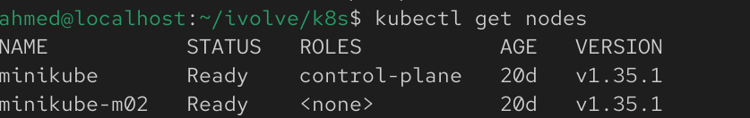
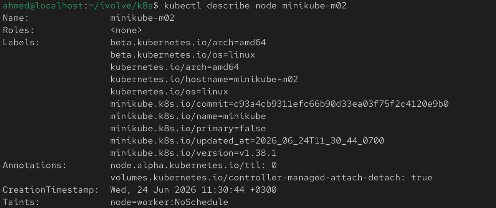

# Lab 10: Node Isolation Using Taints in Kubernetes

## Overview
This lab demonstrates how to isolate a Kubernetes node using taints. A taint prevents pods from being scheduled on a node unless they have a matching toleration. In this lab, one worker node is tainted with the `NoSchedule` effect and the configuration is verified.

## Prerequisites
Before starting, make sure you have:
- Minikube installed
- kubectl installed and configured
- A Kubernetes cluster running with 2 nodes

## Step 1: Start a Kubernetes Cluster with 2 Nodes

Start Minikube with two nodes:

```bash
minikube start --nodes 2
```

Verify the nodes:

```bash
kubectl get nodes
```



## Step 2: Taint One of the Worker Nodes


Apply the taint:

```bash
kubectl taint nodes minikube-m02 node=worker:NoSchedule
```

Expected output:

```text
node/minikube-m02 tainted
```


## Step 3: Verify the Taint

Describe all nodes:

```bash
kubectl describe nodes
```

Or describe only the tainted node:

```bash
kubectl describe node minikube-m02
```

Look for the following section:

```text
Taints:
node=worker:NoSchedule
```



## Notes
- A taint prevents pods from being scheduled on the node unless they have a matching toleration.
- The `NoSchedule` effect ensures that new pods without the required toleration are not placed on the tainted node.
- Existing pods already running on the node are not affected by the `NoSchedule` taint.