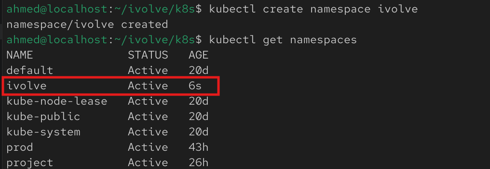
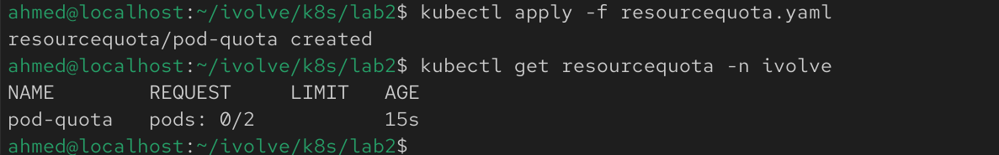
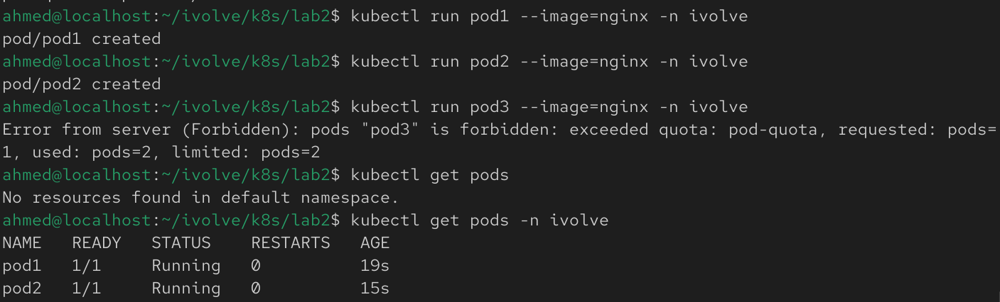

# Lab 11: Namespace Management and Resource Quota Enforcement

## Overview
This lab demonstrates how to create a Kubernetes namespace and enforce resource limits using a ResourceQuota. The quota restricts the namespace so that no more than two pods can be created within it.

## Prerequisites
Before starting, make sure you have:
- A running Kubernetes cluster
- kubectl installed and configured
- Cluster administrator privileges

## Step 1: Create the Namespace

Create a namespace named `ivolve`:

```bash
kubectl create namespace ivolve
```

Verify the namespace was created:

```bash
kubectl get namespaces
```



## Step 2: Create a ResourceQuota

Create a file named `resourcequota.yaml`:

```yaml
apiVersion: v1
kind: ResourceQuota
metadata:
  name: pod-quota
  namespace: ivolve
spec:
  hard:
    pods: "2"
```

Apply the ResourceQuota:

```bash
kubectl apply -f resourcequota.yaml
```


## Step 3: Verify the ResourceQuota

Display the ResourceQuota:

```bash
kubectl get resourcequota -n ivolve
```

View its details:

```bash
kubectl describe resourcequota pod-quota -n ivolve
```

The output should show:

```text
Pods: 0/2
```

indicating that a maximum of two pods are allowed in the `ivolve` namespace.



## Step 4: Verify the Quota Enforcement

Create two pods in the `ivolve` namespace. Both should be created successfully.

Example:

```bash
kubectl run pod1 --image=nginx -n ivolve
kubectl run pod2 --image=nginx -n ivolve
```

Attempt to create a third pod:

```bash
kubectl run pod3 --image=nginx -n ivolve
```

The request should fail due to the applied quota.


## Notes
- Namespaces provide logical isolation for Kubernetes resources.
- ResourceQuotas help prevent a namespace from consuming excessive cluster resources.
- In this lab, the namespace is limited to a maximum of **2 pods**.
- Any attempt to create additional pods beyond the quota will be rejected by Kubernetes.