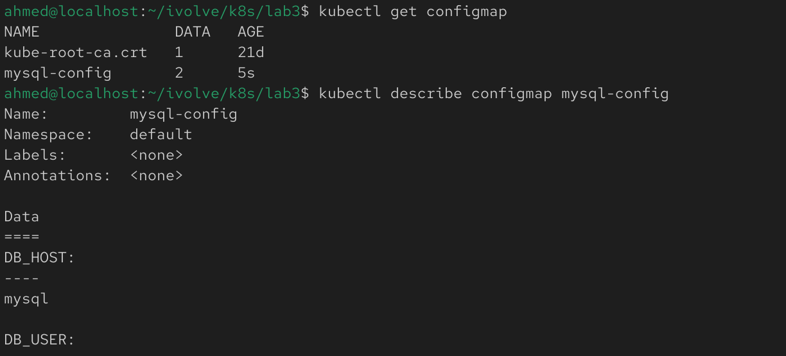
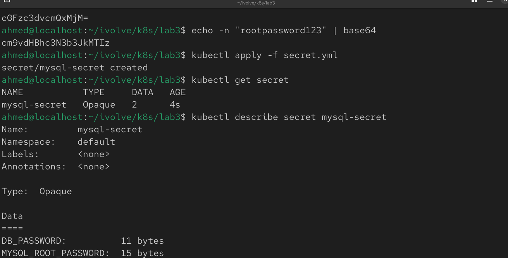

# Lab 12: Managing Configuration and Sensitive Data with ConfigMaps and Secrets

## Overview
This lab demonstrates how to manage application configuration and sensitive data in Kubernetes using ConfigMaps and Secrets. A ConfigMap is used to store non-sensitive MySQL configuration variables, while a Secret securely stores sensitive credentials using Base64 encoding.

## Prerequisites
Before starting, make sure you have:
- A running Kubernetes cluster
- kubectl installed and configured
- A namespace created for your application (optional)

## Step 1: Create a ConfigMap

Create a file named `configmap.yaml`:

```yaml
apiVersion: v1
kind: ConfigMap
metadata:
  name: mysql-config
data:
  DB_HOST: mysql
  DB_USER: ivolve
```

Apply the ConfigMap:

```bash
kubectl apply -f configmap.yaml
```

Verify it was created:

```bash
kubectl get configmap
kubectl describe configmap mysql-config
```



## Step 2: Encode the Secret Values

Before creating the Secret, encode each value using Base64.

Example:

```bash
echo -n "password123" | base64
echo -n "rootpassword123" | base64
```


## Step 3: Create the Secret

Create a file named `secret.yaml`:

```yaml
apiVersion: v1
kind: Secret
metadata:
  name: mysql-secret
type: Opaque
data:
  DB_PASSWORD: cGFzc3dvcmQxMjM=
  MYSQL_ROOT_PASSWORD: cm9vdHBhc3N3b3JkMTIz
```

Apply the Secret:

```bash
kubectl apply -f secret.yaml
```

Verify it was created:

```bash
kubectl get secret
kubectl describe secret mysql-secret
```




> **Note:** Secret values are not displayed in plain text when using `kubectl describe`.


## Notes
- ConfigMaps should be used for non-sensitive configuration values.
- Secrets are designed to store sensitive information such as passwords and API keys.
- Secret values must be Base64 encoded before being added to the manifest.
- Base64 encoding is **not encryption**; it is only an encoding mechanism used by Kubernetes to represent binary data.