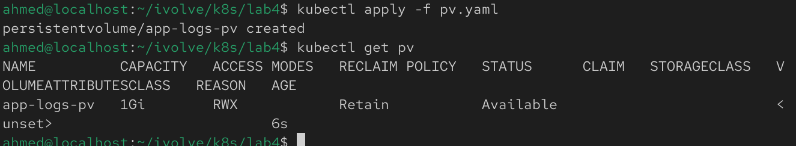
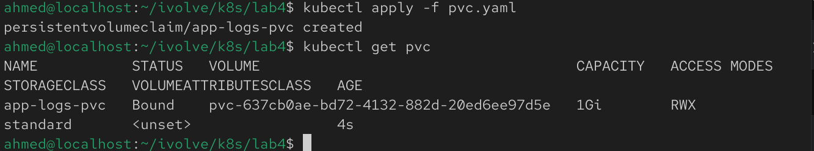
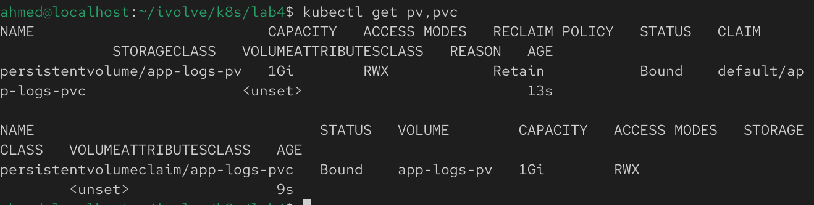

# Lab 13: Persistent Storage Setup for Application Logging

## Overview
This lab demonstrates how to configure persistent storage in Kubernetes using a Persistent Volume (PV) and a Persistent Volume Claim (PVC). The PV uses the `hostPath` storage type to store application logs on the node's filesystem, while the PVC requests and binds to the available storage.

## Prerequisites
Before starting, make sure you have:
- A running Kubernetes cluster
- kubectl installed and configured
- Cluster administrator privileges

## Step 1: Create a Persistent Volume

Create a file named `pv.yaml`:

```yaml
apiVersion: v1
kind: PersistentVolume
metadata:
  name: app-logs-pv
spec:
  capacity:
    storage: 1Gi
  accessModes:
    - ReadWriteMany
  persistentVolumeReclaimPolicy: Retain
  hostPath:
    path: /mnt/app-logs
```

Apply the Persistent Volume:

```bash
kubectl apply -f pv.yaml
```

Verify it was created:

```bash
kubectl get pv
```



## Step 2: Create a Persistent Volume Claim

Create a file named `pvc.yaml`:

```yaml
apiVersion: v1
kind: PersistentVolumeClaim
metadata:
  name: app-logs-pvc
spec:
  accessModes:
    - ReadWriteMany
  resources:
    requests:
      storage: 1Gi
```

Apply the Persistent Volume Claim:

```bash
kubectl apply -f pvc.yaml
```

Verify it was created:

```bash
kubectl get pvc
```



## Step 3: Verify the PV and PVC Binding

Check the status of the Persistent Volume:

```bash
kubectl get pv
```

Check the status of the Persistent Volume Claim:

```bash
kubectl get pvc
```

Describe the Persistent Volume:

```bash
kubectl describe pv app-logs-pv
```

Describe the Persistent Volume Claim:

```bash
kubectl describe pvc app-logs-pvc
```

The status should indicate that the PV and PVC are successfully bound:

```text
STATUS: Bound
```


## Notes
- The Persistent Volume provides **1Gi** of storage using the `hostPath` storage type.
- The storage location on the node is `/mnt/app-logs`.
- Both the PV and PVC use the `ReadWriteMany` access mode.
- The `Retain` reclaim policy ensures that the stored data remains even after the PVC is deleted.
- The PVC automatically binds to a matching PV that satisfies its storage and access mode requirements.