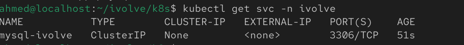
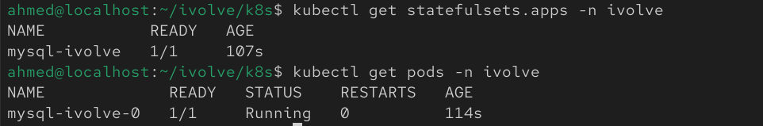
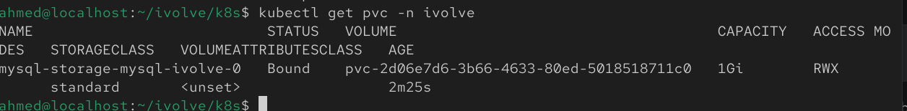
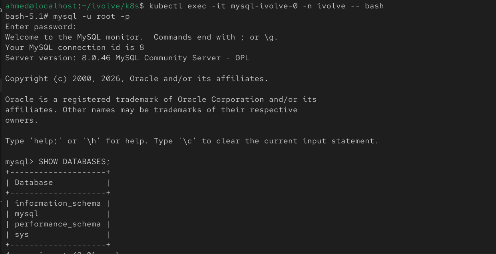

# Lab 14: StatefulSet with Headless Service

## Overview
This lab demonstrates how to deploy a MySQL database using a Kubernetes StatefulSet. The StatefulSet consumes sensitive credentials from a Secret, uses persistent storage through a Persistent Volume Claim (PVC), includes a toleration for a tainted node, and is exposed through a Headless Service for stable network identities.

## Prerequisites
Before starting, make sure you have:
- A running Kubernetes cluster
- kubectl installed and configured
- A Secret containing the MySQL root password
- A Persistent Volume (PV) available for binding

## Step 1: Create the Headless Service

Create a file named `mysql-headless-service.yaml`:

```yaml
apiVersion: v1
kind: Service
metadata:
  name: mysql
spec:
  clusterIP: None
  selector:
    app: mysql
  ports:
    - port: 3306
      targetPort: 3306
```

Apply the service:

```bash
kubectl apply -f headless-svc.yaml
```

Verify it was created:

```bash
kubectl get svc
```


## Step 2: Create the StatefulSet

Create a file named `mysql-statefulset.yaml`:

```yaml
apiVersion: apps/v1
kind: StatefulSet
metadata:
  name: mysql
spec:
  serviceName: mysql
  replicas: 1
  selector:
    matchLabels:
      app: mysql
  template:
    metadata:
      labels:
        app: mysql
    spec:
      tolerations:
        - key: "node"
          operator: "Equal"
          value: "worker"
          effect: "NoSchedule"
      containers:
        - name: mysql
          image: mysql:8.0
          ports:
            - containerPort: 3306
          env:
            - name: MYSQL_ROOT_PASSWORD
              valueFrom:
                secretKeyRef:
                  name: mysql-secret
                  key: MYSQL_ROOT_PASSWORD
          volumeMounts:
            - name: mysql-storage
              mountPath: /var/lib/mysql
  volumeClaimTemplates:
    - metadata:
        name: mysql-storage
      spec:
        accessModes:
          - ReadWriteMany
        resources:
          requests:
            storage: 1Gi
```

Apply the StatefulSet:

```bash
kubectl apply -f statefulset.yaml
```

Verify it was created:

```bash
kubectl get statefulsets
kubectl get pods
```


## Step 3: Verify the Persistent Volume Claim

Display the created PVC:

```bash
kubectl get pvc
```

Describe the PVC:

```bash
kubectl describe pvc
```

The PVC should be bound to an available Persistent Volume.



## Step 4: Confirm the Database is Operational

Connect to the MySQL pod:

```bash
kubectl exec -it mysql-ivolve-0 -n ivolve -- bash
```

Connect to MySQL using the root password stored in the Secret:

```bash
mysql -u root -p
```

After entering the password, verify the connection:

```sql
SHOW DATABASES;
```

The default MySQL databases should be displayed.


## Notes
- StatefulSets provide stable pod identities and persistent storage for stateful applications.
- The Headless Service (`clusterIP: None`) allows each StatefulSet pod to have a stable DNS name.
- The MySQL root password is securely injected from a Kubernetes Secret from `lab3/secret.yml`.
- The StatefulSet mounts persistent storage at `/var/lib/mysql` to preserve database data.
- The toleration allows the MySQL pod to be scheduled on nodes tainted with `node=worker:NoSchedule`.