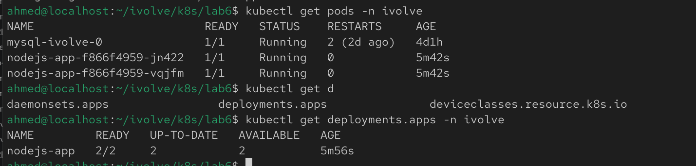
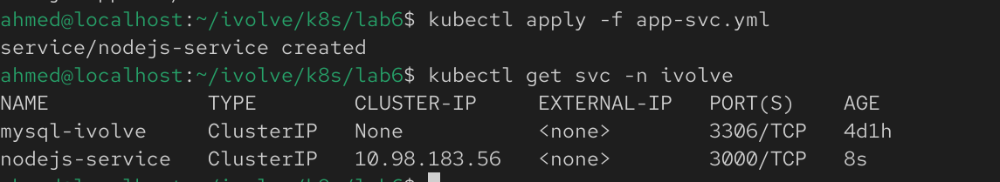
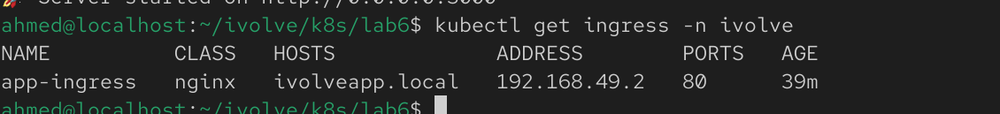
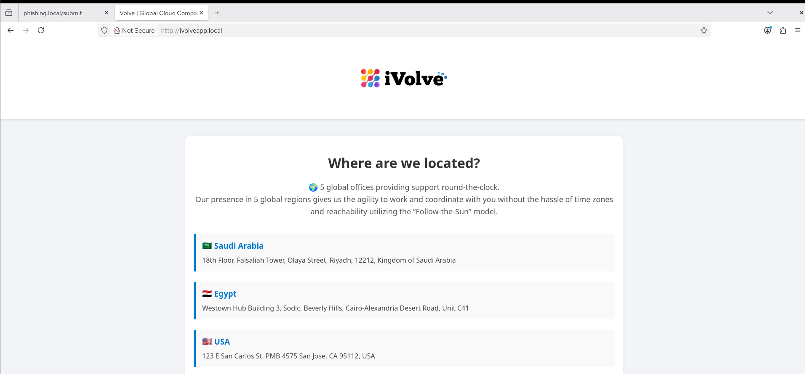

# Lab 15: Node.js Application Deployment with ClusterIP Service

## Overview
This lab demonstrates how to deploy a Node.js application in Kubernetes using a Deployment and expose it internally through a ClusterIP Service. The application uses environment variables from a ConfigMap and Secret, mounts a Persistent Volume through a Persistent Volume Claim (PVC), and includes a toleration to allow scheduling on a tainted worker node.

## Prerequisites
Before starting, make sure you have:
- A running Kubernetes cluster
- kubectl installed and configured
- Your custom Node.js Docker image pushed to Docker Hub
- A ConfigMap and Secret already created
- A Persistent Volume (PV) and Persistent Volume Claim (PVC) available

## Step 1: Create the Deployment

Create a file named `deployment.yaml`:

```yaml
apiVersion: apps/v1
kind: Deployment
metadata:
  name: nodejs-app
spec:
  replicas: 2
  selector:
    matchLabels:
      app: nodejs-app
  template:
    metadata:
      labels:
        app: nodejs-app
    spec:
      tolerations:
        - key: "node"
          operator: "Equal"
          value: "worker"
          effect: "NoSchedule"
      containers:
        - name: nodejs-app
          image: <your-dockerhub-username>/<your-image>:latest
          ports:
            - containerPort: 3000
          envfrom:
            - configMapRef:
                name: mysql-config
            - secretRef:
                name: mysql-secret
          volumeMounts:
            - name: app-storage
              mountPath: /usr/src/app/logs
      volumes:
        - name: app-storage
          persistentVolumeClaim:
            claimName: app-logs-pvc
```

Apply the Deployment:

```bash
kubectl apply -f app-deploy.yaml
```

Verify it was created:

```bash
kubectl get deployments
kubectl get pods
```



## Step 2: Create the ClusterIP Service

Create a file named `service.yaml`:

```yaml
apiVersion: v1
kind: Service
metadata:
  name: nodejs-service
spec:
  type: ClusterIP
  selector:
    app: nodejs-app
  ports:
    - port: 80
      targetPort: 3000
```

Apply the Service:

```bash
kubectl apply -f service.yaml
```

Verify it was created:

```bash
kubectl get svc
```


The service should expose an internal ClusterIP and route traffic to the available application pods.


## Step 3: Expose the Application through ingress based on hostname

Apply the ingress file:

```bash
kubectl apply -f ingress.yml
```

Add hostname `ivolveapp.com` to hosts

```bash
sudo vim /etc/hosts
```
then add `<minikube ip> ivolveapp.local` writing in that file.


Verification:

```bash
kubectl get ingress -n ivolve
```


Use `ivolveapp.local` from the browser



#### Couple Notes here to decrease troubleshooting:
- Make sure the ingress file have the correct name from `app-svc.yml`.
- The `DB_HOST` variable must match the name of the headless service for the mysql statefulset.
- Check if the mysql user has been initalliazed in the first booting of the stateful set.
- Check the logs to make sure the backend can reach the database. 
```bash
kubectl logs <nodejs-pod-name> -n ivolve
```
 
## Notes
- The Deployment creates **2 replicas**, but depending on cluster resources and taints, only one pod may be scheduled successfully due to resource quota applied to the namespace in lab2 but in my case both are working.
- The application reads non-sensitive configuration from a ConfigMap and sensitive credentials from a Secret.
- The application uses a Persistent Volume through the `app-logs-pvc` claim for persistent storage.
- The `ClusterIP` service exposes the application internally within the Kubernetes cluster and load-balances traffic across the available replicas.
