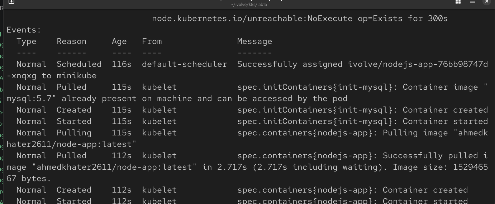
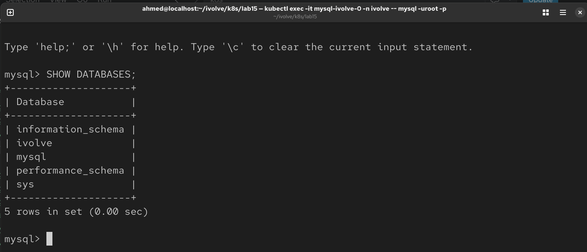
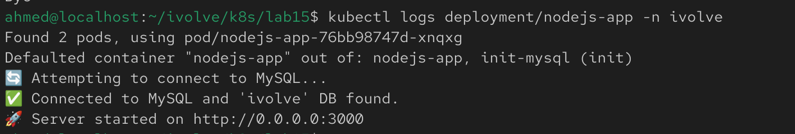

## Lab 16: Kubernetes Init Container for Pre-Deployment Database Setup

## Overview
This lab demonstrates how to use an **Init Container** in Kubernetes to prepare a MySQL database before the main application starts. The init container connects to the MySQL server, creates the `ivolve` database if it does not exist, creates the application user, and grants the required privileges. The main Node.js container starts only after the initialization process completes successfully.

## Prerequisites
Before starting, make sure you have:
- A running Kubernetes cluster
- MySQL StatefulSet and Headless Service from the previous lab
- ConfigMap and Secret containing the database configuration
- Node.js Docker image pushed to Docker Hub
- `kubectl` configured to access your cluster

## Step 1: Modify the Node.js Deployment
Update the existing Deployment to include an **Init Container**.

The init container should:
- Use the `mysql:5.7` image
- Read database connection information from the existing ConfigMap and Secret
- Connect to the MySQL server
- Create the `ivolve` database if it does not exist
- Create the application user if it does not exist
- Grant all privileges on the `ivolve` database to the application user

Example:

```yaml
initContainers:
- name: mysql-init
  image: mysql:5.7
  command:
    - sh
    - -c
    - |
      mysql -h "$DB_HOST" -u root -p"$MYSQL_ROOT_PASSWORD" <<EOF
      CREATE DATABASE IF NOT EXISTS ivolve;
      CREATE USER IF NOT EXISTS '$DB_USER'@'%' IDENTIFIED BY '$DB_PASSWORD';
      GRANT ALL PRIVILEGES ON ivolve.* TO '$DB_USER'@'%';
      FLUSH PRIVILEGES;
      EOF
  env:
  - name: DB_HOST
    valueFrom:
      configMapKeyRef:
        name: mysql-config
        key: DB_HOST
  - name: DB_USER
    valueFrom:
      configMapKeyRef:
        name: mysql-config
        key: DB_USER
  - name: DB_PASSWORD
    valueFrom:
      secretKeyRef:
        name: mysql-secret
        key: DB_PASSWORD
  - name: MYSQL_ROOT_PASSWORD
    valueFrom:
      secretKeyRef:
        name: mysql-secret
        key: MYSQL_ROOT_PASSWORD
```

## Step 2: Apply the Updated Deployment
Apply the modified deployment manifest:

```bash
kubectl apply -f app-deploy.yaml
```

Verify that the Deployment was updated successfully.


## Step 3: Verify the Init Container
Check that the init container completed successfully before the application container started.

```bash
kubectl get pods -n ivolve
```

Describe the pod to view the init container status:

```bash
kubectl describe pod <nodejs-pod-name> -n ivolve
```



## Step 4: Verify the Database
Connect to the MySQL pod:

```bash
kubectl exec -it mysql-ivolve-0 -n ivolve -- mysql -uroot -p
```

Enter the root password when prompted.

Verify that the `ivolve` database exists:

```sql
SHOW DATABASES;
```

Verify that the application user exists:

```sql
SELECT User, Host FROM mysql.user;
```

Check the privileges assigned to the user:

```sql
SHOW GRANTS FOR 'ivolve'@'%';
```



## Step 5: Verify the Application
Confirm that the Node.js application starts successfully and connects to the database.

Check the application logs:

```bash
kubectl logs deployment/nodejs-app -n ivolve
```

You should see the application connecting successfully without database authentication errors.


## Notes
- Init Containers always complete before the main application container starts.
- The init container executes only once for each Pod creation.
- Using `CREATE DATABASE IF NOT EXISTS` and `CREATE USER IF NOT EXISTS` makes the initialization process safe to run multiple times.
- Database credentials should always be stored in Kubernetes Secrets rather than directly in the manifest.