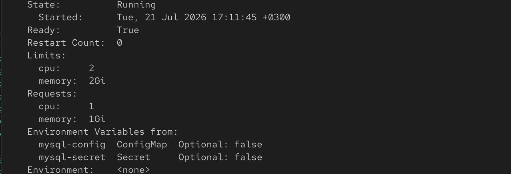
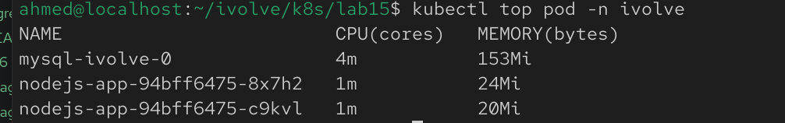

## Lab 17: Pod Resource Management with CPU and Memory Requests and Limits

## Overview
This lab demonstrates how to manage CPU and memory resources for a Kubernetes Deployment using **resource requests** and **resource limits**. Requests reserve the minimum amount of resources required by the container, while limits define the maximum resources the container is allowed to consume.

## Prerequisites
Before starting, make sure you have:
- A running Kubernetes cluster
- The Node.js Deployment from the previous lab
- Metrics Server installed in the cluster (required for `kubectl top`)
- `kubectl` configured to access your cluster

## Step 1: Update the Node.js Deployment
Modify the existing Deployment to include CPU and memory requests and limits.

Example:

```yaml
resources:
  requests:
    cpu: "1"
    memory: "1Gi"
  limits:
    cpu: "2"
    memory: "2Gi"
```

The resources section should be added under the Node.js container specification.

## Step 2: Apply the Updated Deployment
Apply the updated deployment manifest:

```bash
kubectl apply -f app-deploy.yml
```

Verify that the Deployment was updated successfully.


## Step 3: Verify Resource Requests and Limits
Check that the pod has the configured resource requests and limits.

List the pods:

```bash
kubectl get pods -n ivolve
```

Describe one of the Node.js pods:

```bash
kubectl describe pod <nodejs-pod-name> -n ivolve
```

Under the **Containers** section, verify:

```text
Requests:
  cpu:     1
  memory:  1Gi

Limits:
  cpu:     2
  memory:  2Gi
```


## Step 4: Monitor Resource Usage
Monitor the real-time CPU and memory usage of the running pods.

```bash
kubectl top pod -n ivolve
```

Example output:

```text
NAME                          CPU(cores)   MEMORY(bytes)
nodejs-app-xxxxxxxxxx-xxxxx   5m           40Mi
nodejs-app-xxxxxxxxxx-yyyyy   6m           42Mi
mysql-ivolve-0                8m           95Mi
```


## Notes
- **Requests** define the minimum CPU and memory reserved for the container by the Kubernetes scheduler.
- **Limits** define the maximum CPU and memory the container is allowed to use.
- If a container exceeds its **memory limit**, Kubernetes may terminate it with an **Out Of Memory (OOMKilled)** error.
- If a container exceeds its **CPU limit**, Kubernetes throttles its CPU usage instead of terminating it.
- The `kubectl top` command requires the **Metrics Server** to be installed and running in the cluster.