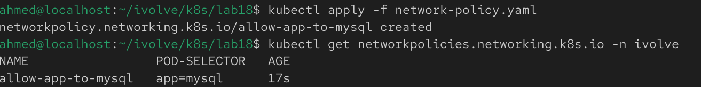
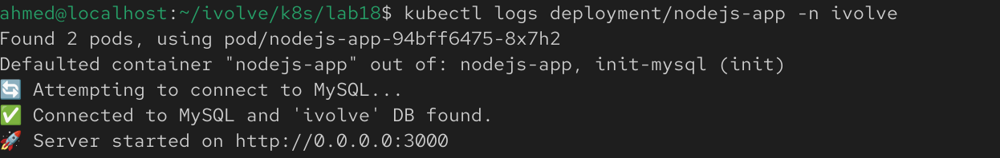
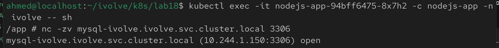
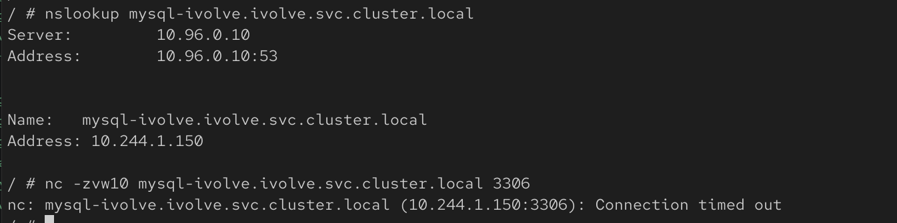

## Lab 18: Control Pod-to-Pod Traffic via Network Policy

## Overview
This lab demonstrates how to secure communication between Kubernetes pods using a **NetworkPolicy**. The policy restricts access to the MySQL pods so that only the Node.js application pods can communicate with the database on the MySQL port (3306).

## Prerequisites
Before starting, make sure you have:
- A running Kubernetes cluster with a CNI plugin that supports Network Policies (e.g., Calico or Cilium)
- The MySQL StatefulSet running
- The Node.js Deployment running
- `kubectl` configured to access your cluster

## Step 1: Create the NetworkPolicy
Create a NetworkPolicy named **allow-app-to-mysql**.

The policy should:
- Target the MySQL pods (`app=mysql`)
- Allow only **Ingress** traffic
- Permit connections only from the Node.js application pods
- Allow traffic only on TCP port **3306**

Example:

```yaml
apiVersion: networking.k8s.io/v1
kind: NetworkPolicy
metadata:
  name: allow-app-to-mysql
  namespace: ivolve
spec:
  podSelector:
    matchLabels:
      app: mysql

  policyTypes:
    - Ingress

  ingress:
    - from:
        - podSelector:
            matchLabels:
              app: nodejs-app
      ports:
        - protocol: TCP
          port: 3306
```

## Step 2: Apply the NetworkPolicy
Apply the manifest:

```bash
kubectl apply -f network-policy.yaml
```

Verify that the policy was created successfully.




## Step 3: Test Connectivity
Verify that the Node.js application can still connect to MySQL.

Check the application logs:

```bash
kubectl logs deployment/nodejs-app -n ivolve
```

The application should connect successfully without database connection errors.



## Step 4: Verify Access Restrictions
Launch a temporary pod that does **not** have the `app=nodejs-app` label.

```bash
kubectl run test-client --image=busybox:1.36 --restart=Never --overrides='{"apiVersion":"v1","spec":{"tolerations":[{"key":"node","operator":"Equal","value":"worker","effect":"NoSchedule"}]}}' -it --rm -- sh
```
- Needed taint for the test pod to work.

Inside the pod, attempt to connect to the MySQL service:

```sh
nc -zv mysql-ivolve 3306
```

The connection should fail because the NetworkPolicy blocks traffic from pods that do not match the allowed label.



## Notes
- A NetworkPolicy only takes effect if your cluster uses a **CNI plugin that supports Network Policies**.
- This policy restricts **Ingress** traffic only. Outbound (Egress) traffic is unaffected.
- Only pods with the label `app=nodejs-app` are allowed to communicate with the MySQL pods on TCP port **3306**.
- Pods that do not match the allowed label will be denied access to the MySQL database.