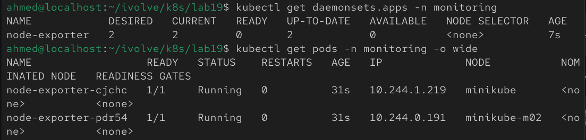
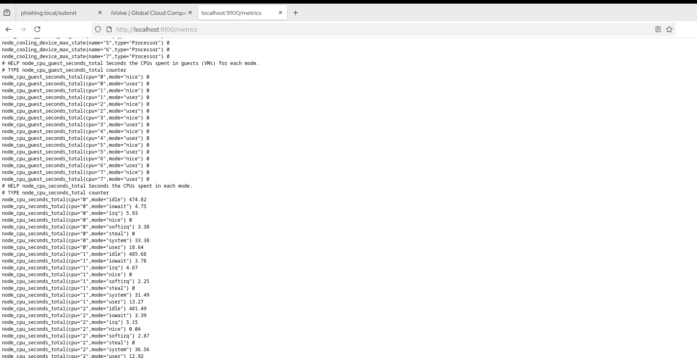

## Lab 19: Node-Wide Pod Management with DaemonSet

## Overview
This lab demonstrates how to deploy a **DaemonSet** in Kubernetes. A DaemonSet ensures that a copy of a Pod runs on every node in the cluster. In this lab, Prometheus **node-exporter** is deployed to collect node-level metrics, and the DaemonSet is configured to tolerate all existing taints so that it can run on every node.

## Prerequisites
Before starting, make sure you have:
- A running Kubernetes cluster
- At least two worker nodes
- `kubectl` configured to access your cluster
- Internet access to pull the `prom/node-exporter` image

## Step 1: Create the Monitoring Namespace
Create a dedicated namespace for monitoring resources.

```bash
kubectl create namespace monitoring
```

Verify the namespace was created:

```bash
kubectl get namespaces
```


## Step 2: Create the DaemonSet
Create a DaemonSet that deploys Prometheus **node-exporter** on every node.

The DaemonSet should:
- Use the `prom/node-exporter` image
- Run one Pod per node
- Tolerate all existing taints
- Expose port **9100**

Example:

```yaml
apiVersion: apps/v1
kind: DaemonSet
metadata:
  name: node-exporter
  namespace: monitoring
spec:
  selector:
    matchLabels:
      app: node-exporter
  template:
    metadata:
      labels:
        app: node-exporter
    spec:
      tolerations:
        - operator: Exists

      containers:
        - name: node-exporter
          image: prom/node-exporter:v1.9.1
          ports:
            - name: metrics
              containerPort: 9100
              hostPort: 9100
          args:
            - --path.rootfs=/host
          volumeMounts:
            - name: root
              mountPath: /host
              readOnly: true

      volumes:
        - name: root
          hostPath:
            path: /
```

## Step 3: Apply the DaemonSet
Apply the manifest:

```bash
kubectl apply -f daemonset.yaml
```

Verify that the DaemonSet was created successfully.


## Step 4: Verify the DaemonSet
List the DaemonSets:

```bash
kubectl get daemonsets -n monitoring
```

Verify that one Pod is running on each node:

```bash
kubectl get pods -n monitoring -o wide
```

You should see one **node-exporter** Pod scheduled on every node.


## Step 5: Verify Metrics Exposure
Access the metrics endpoint from one of the node-exporter Pods.

First, forward port **9100**:

```bash
kubectl port-forward -n monitoring daemonset/node-exporter 9100:9100
```

In another terminal or browser, access:

```text
http://localhost:9100/metrics
```

Alternatively, use `curl`:

```bash
curl http://localhost:9100/metrics
```

You should see Prometheus metrics similar to:

```text
# HELP node_cpu_seconds_total Seconds the CPUs spent in each mode.
# TYPE node_cpu_seconds_total counter
node_cpu_seconds_total{cpu="0",mode="idle"} ...
```


## Notes
- A DaemonSet ensures that exactly one Pod runs on every eligible node.
- The toleration `operator: Exists` allows the DaemonSet Pods to be scheduled on nodes with any taint.
- Prometheus **node-exporter** exposes node metrics on port **9100**.
- These metrics can later be scraped by a Prometheus server for monitoring and visualization.