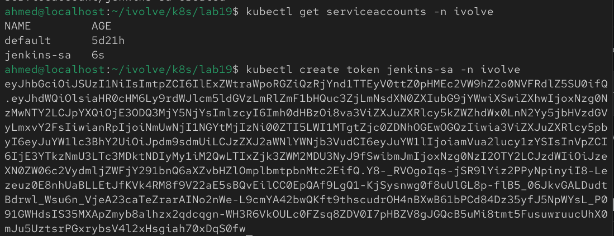
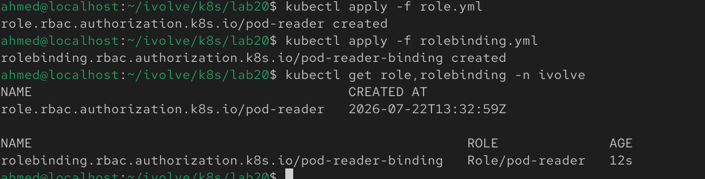
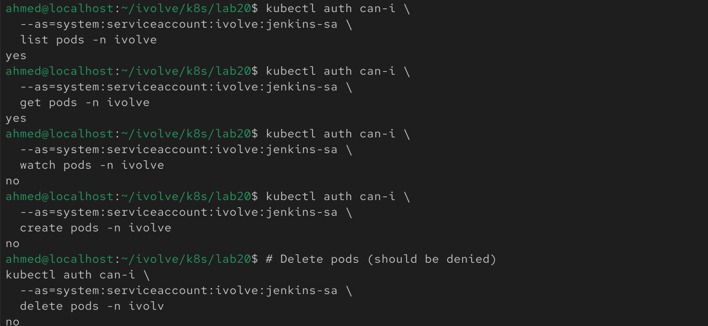

## Lab 20: Securing Kubernetes with RBAC and Service Accounts

## Overview
This lab demonstrates how to secure access to Kubernetes resources using **Role-Based Access Control (RBAC)**. A dedicated ServiceAccount is created for Jenkins, a Role is defined with read-only permissions for Pods, and a RoleBinding grants those permissions to the ServiceAccount. Finally, the permissions are validated using the generated token.

## Prerequisites
Before starting, make sure you have:
- A running Kubernetes cluster
- `kubectl` configured to access the cluster
- The `ivolve` namespace already created

## Step 1: Create the Service Account
Create a ServiceAccount named **jenkins-sa** in the **ivolve** namespace.

```bash
kubectl create serviceaccount jenkins-sa -n ivolve
```

Verify it was created:

```bash
kubectl get serviceaccounts -n ivolve
```


## Step 2: Generate a Token
Generate a token for the ServiceAccount.

```bash
kubectl create token jenkins-sa -n ivolve
```

Copy the generated token for the validation step.


## Step 3: Create the Role
Create a Role that grants read-only access to Pods within the **ivolve** namespace.

Example:

```yaml
apiVersion: rbac.authorization.k8s.io/v1
kind: Role
metadata:
  name: pod-reader
  namespace: ivolve
rules:
- apiGroups: [""]
  resources: ["pods"]
  verbs: ["get", "list"]
```

Apply the manifest:

```bash
kubectl apply -f role.yaml
```

Verify the Role:

```bash
kubectl get role -n ivolve
```

## Step 4: Create the RoleBinding
Bind the **pod-reader** Role to the **jenkins-sa** ServiceAccount.

Example:

```yaml
apiVersion: rbac.authorization.k8s.io/v1
kind: RoleBinding
metadata:
  name: pod-reader-binding
  namespace: ivolve
subjects:
- kind: ServiceAccount
  name: jenkins-sa
  namespace: ivolve
roleRef:
  apiGroup: rbac.authorization.k8s.io
  kind: Role
  name: pod-reader
```

Apply the manifest:

```bash
kubectl apply -f rolebinding.yaml
```

Verify the RoleBinding:

```bash
kubectl get rolebinding -n ivolve
```


## Step 5: Validate the Permissions
Store the generated token in an environment variable:

```bash
TOKEN=$(kubectl create token jenkins-sa -n ivolve)
```

Verify that the ServiceAccount can list Pods:

```bash
kubectl auth can-i \
  --as=system:serviceaccount:ivolve:jenkins-sa \
  list pods -n ivolve
  ```

Expected output:

```text
yes
```

Verify that it can get Pods:

```bash
kubectl auth can-i \
  --as=system:serviceaccount:ivolve:jenkins-sa \
  get pods -n ivolve
```

Expected output:

```text
yes
```

Verify that it **cannot** create Pods:

```bash
kubectl auth can-i \
  --as=system:serviceaccount:ivolve:jenkins-sa \
  create pods -n ivolve
```

Expected output:

```text
no
```

Verify that it **cannot** delete Pods:

```bash
kubectl auth can-i \
  --as=system:serviceaccount:ivolve:jenkins-sa \
  delete pods -n ivolve
```

Expected output:

```text
no
```


## Notes
- A **ServiceAccount** provides an identity for applications running inside Kubernetes.
- A **Role** defines permissions within a specific namespace.
- A **RoleBinding** grants the permissions defined by a Role to a user, group, or ServiceAccount.
- Following the principle of least privilege, the `jenkins-sa` ServiceAccount is granted only the minimum permissions required to **get** and **list** Pods in the `ivolve` namespace.